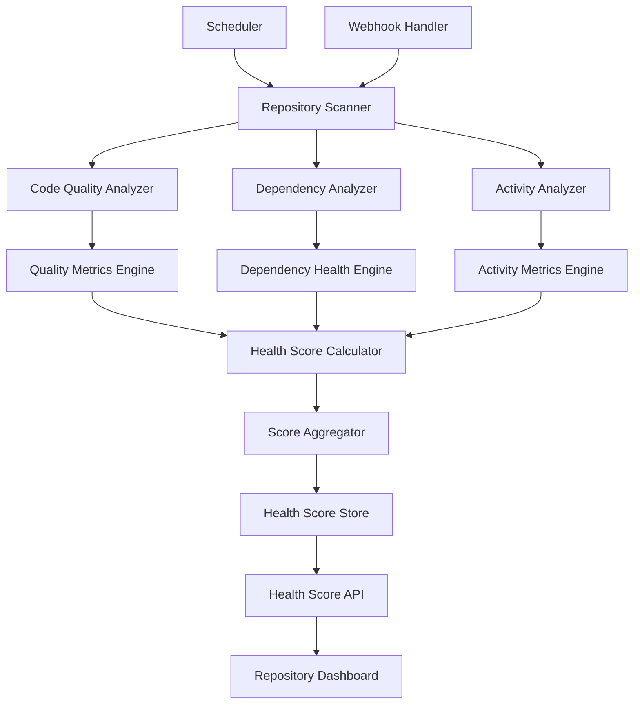

# Design Document - Automated Health Scoring

## Overview

The Automated Health Scoring system is a comprehensive repository evaluation engine that continuously assesses open source project health through multi-dimensional analysis. The system combines static code analysis, dependency scanning, and activity monitoring to generate real-time health scores that help students identify high-quality, well-maintained repositories for contribution.

## Architecture



The system follows a modular analysis architecture with the following components:

- **Repository Scanner**: Crawls and extracts repository data for analysis
- **Analysis Engines**: Specialized analyzers for code quality, dependencies, and activity
- **Health Score Calculator**: Combines analysis results into comprehensive health scores
- **Storage Layer**: Maintains health scores and historical trends
- **API Layer**: Provides access to health data for frontend consumption

## Components and Interfaces

### Code Quality Analyzer

**Purpose**: Analyze code quality metrics including complexity, maintainability, and best practices

**Key Classes**:
- `CodeComplexityAnalyzer`: Measures cyclomatic complexity and code structure
- `CodeStandardsChecker`: Verifies adherence to coding standards and best practices
- `TechnicalDebtDetector`: Identifies code smells, duplication, and technical debt
- `DocumentationAnalyzer`: Assesses code documentation coverage and quality

**Interfaces**:
```typescript
interface CodeQualityAnalyzer {
  analyzeRepository(repoUrl: string): Promise<CodeQualityMetrics>
  scanCodeComplexity(filePaths: string[]): Promise<ComplexityMetrics>
}

interface CodeQualityMetrics {
  repositoryUrl: string
  overallQualityScore: number // 1-100 scale
  complexityMetrics: {
    cyclomaticComplexity: number
    cognitiveComplexity: number
    nestingDepth: number
    functionLength: number
  }
  maintainabilityMetrics: {
    maintainabilityIndex: number
    codeDuplication: number
    technicalDebtRatio: number
    codeSmellCount: number
  }
  standardsCompliance: {
    lintingScore: number
    formattingConsistency: number
    namingConventions: number
    documentationCoverage: number
  }
  qualityTrends: {
    improvementRate: number
    regressionCount: number
    consistencyScore: number
  }
  analyzedAt: Date
  confidence: number
}
```

### Dependency Analyzer

**Purpose**: Analyze dependency freshness, security, and maintenance status

**Key Classes**:
- `DependencyScanner`: Scans package files and extracts dependency information
- `VersionChecker`: Compares current versions against latest available versions
- `SecurityAnalyzer`: Checks for known vulnerabilities in dependencies
- `DependencyHealthCalculator`: Calculates overall dependency health scores

**Interfaces**:
```typescript
interface DependencyAnalyzer {
  analyzeDependencies(repoUrl: string): Promise<DependencyHealth>
  checkSecurityVulnerabilities(dependencies: Dependency[]): Promise<SecurityReport>
}

interface DependencyHealth {
  repositoryUrl: string
  overallDependencyScore: number // 1-100 scale
  dependencyMetrics: {
    totalDependencies: number
    outdatedDependencies: number
    vulnerableDependencies: number
    abandonedDependencies: number
  }
  freshnessMetrics: {
    averageAge: number // days behind latest
    criticallyOutdated: number
    minorUpdatesAvailable: number
    majorUpdatesAvailable: number
  }
  securityMetrics: {
    highSeverityVulnerabilities: number
    mediumSeverityVulnerabilities: number
    lowSeverityVulnerabilities: number
    securityScore: number
  }
  maintenanceMetrics: {
    activeMaintenance: number
    communitySupport: number
    updateFrequency: number
  }
  analyzedAt: Date
  nextScanDate: Date
}
```

### Activity Analyzer

**Purpose**: Monitor repository activity patterns and maintenance indicators

**Key Classes**:
- `CommitActivityAnalyzer`: Analyzes commit frequency and patterns
- `ReleasePatternAnalyzer`: Evaluates release frequency and versioning practices
- `CommunityEngagementAnalyzer`: Measures community activity and responsiveness
- `MaintenanceIndicatorCalculator`: Calculates overall maintenance health

**Interfaces**:
```typescript
interface ActivityAnalyzer {
  analyzeActivity(repoUrl: string): Promise<ActivityMetrics>
  calculateMaintenanceHealth(activityData: ActivityData): Promise<MaintenanceHealth>
}

interface ActivityMetrics {
  repositoryUrl: string
  overallActivityScore: number // 1-100 scale
  commitMetrics: {
    recentCommits: number // last 30 days
    commitFrequency: number // commits per week
    contributorCount: number
    commitConsistency: number
  }
  releaseMetrics: {
    recentReleases: number // last 6 months
    releaseFrequency: number
    versioningConsistency: number
    releaseNoteQuality: number
  }
  communityMetrics: {
    issueResponseTime: number // hours
    prResponseTime: number // hours
    communityGrowth: number
    maintainerActivity: number
  }
  vitalityIndicators: {
    projectMomentum: number
    developmentVelocity: number
    communityHealth: number
    futureViability: number
  }
  analyzedAt: Date
}
```

### Health Score Calculator

**Purpose**: Combine analysis results into comprehensive health scores with weighting

**Key Classes**:
- `ScoreAggregator`: Combines component scores using weighted algorithms
- `WeightingEngine`: Applies appropriate weights based on repository characteristics
- `TrendAnalyzer`: Incorporates historical trends into current scoring
- `ConfidenceCalculator`: Determines confidence levels for health scores

**Interfaces**:
```typescript
interface HealthScoreCalculator {
  calculateHealthScore(analysisResults: AnalysisResults): Promise<HealthScore>
  updateWeights(repoType: string, language: string): Promise<ScoringWeights>
}

interface AnalysisResults {
  codeQualityMetrics: CodeQualityMetrics
  dependencyHealth: DependencyHealth
  activityMetrics: ActivityMetrics
  repositoryMetadata: RepositoryMetadata
}

interface HealthScore {
  repositoryUrl: string
  overallScore: number // 1-100 scale
  componentScores: {
    codeQuality: number
    dependencyHealth: number
    activityLevel: number
    maintenance: number
  }
  scoringWeights: ScoringWeights
  confidence: number
  scoreBreakdown: {
    strengths: string[]
    weaknesses: string[]
    recommendations: string[]
  }
  trends: {
    scoreChange: number
    trendDirection: 'improving' | 'stable' | 'declining'
    historicalScores: HistoricalScore[]
  }
  calculatedAt: Date
  nextUpdateDate: Date
}

interface ScoringWeights {
  codeQuality: number
  dependencyHealth: number
  activityLevel: number
  maintenance: number
  communityHealth: number
}
```

## Data Models

### Repository Health Score Schema
```typescript
interface RepositoryHealthScore {
  id: string
  repositoryUrl: string
  repositoryName: string
  overallHealthScore: number
  componentScores: {
    codeQuality: number
    dependencyHealth: number
    activityLevel: number
    maintenance: number
    communityHealth: number
  }
  detailedMetrics: {
    codeComplexity: number
    technicalDebt: number
    testCoverage: number
    documentationCoverage: number
    dependencyFreshness: number
    securityVulnerabilities: number
    commitFrequency: number
    releaseFrequency: number
    communityEngagement: number
    maintainerResponsiveness: number
  }
  scoringWeights: {
    codeQuality: number
    dependencyHealth: number
    activityLevel: number
    maintenance: number
    communityHealth: number
  }
  confidence: number
  trends: {
    scoreChange: number
    trendDirection: string
    improvementAreas: string[]
    regressionAreas: string[]
  }
  lastAnalyzed: Date
  nextScheduledScan: Date
  analysisVersion: number
}
```

### Analysis History Schema
```typescript
interface AnalysisHistory {
  id: string
  repositoryUrl: string
  analysisType: 'code_quality' | 'dependency_health' | 'activity_metrics'
  analysisDate: Date
  metrics: {
    [key: string]: number
  }
  issues: {
    severity: 'high' | 'medium' | 'low'
    category: string
    description: string
    recommendation: string
  }[]
  improvements: {
    area: string
    previousValue: number
    currentValue: number
    improvementPercentage: number
  }[]
  regressions: {
    area: string
    previousValue: number
    currentValue: number
    regressionPercentage: number
  }[]
}
```

## Error Handling

### Analysis Errors
- **Repository Access Issues**: Handle private repositories and authentication failures gracefully
- **Large Repository Processing**: Implement sampling strategies for very large codebases
- **Analysis Tool Failures**: Provide fallback analysis methods when primary tools fail
- **Incomplete Data**: Generate partial scores when some analysis components fail

### Scoring Errors
- **Weight Calibration Issues**: Use default weights when custom weighting fails
- **Score Calculation Failures**: Provide fallback scoring algorithms
- **Trend Analysis Errors**: Handle cases with insufficient historical data
- **Confidence Calculation Issues**: Provide conservative confidence estimates

### Performance Errors
- **Analysis Timeouts**: Implement progressive analysis with time limits
- **Memory Constraints**: Use streaming processing for large repositories
- **Concurrent Analysis**: Manage resource usage during bulk health scoring
- **Storage Limitations**: Implement data retention policies for analysis history