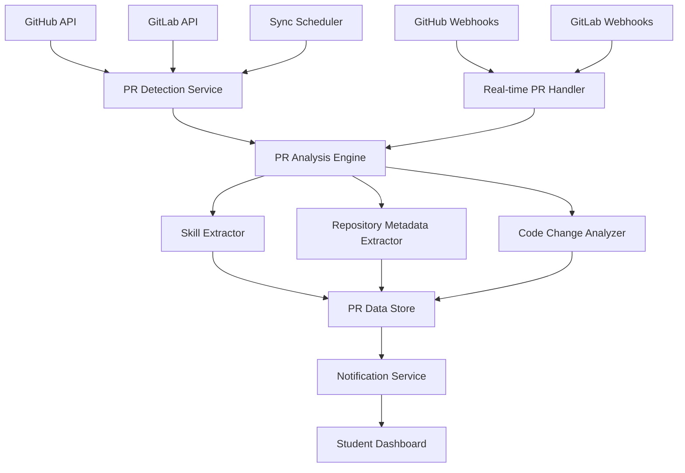

# Design Document - Automated PR Tracker

## Overview

The Automated PR Tracker is a comprehensive system that synchronizes with GitHub and GitLab APIs to automatically detect, log, and analyze student pull requests. The system uses webhook-based real-time tracking combined with periodic synchronization to ensure complete coverage of student contributions, while applying intelligent analysis to extract skill attributes and repository metadata.

## Architecture



The system follows an event-driven architecture with the following components:

- **API Integration Layer**: Handles communication with GitHub and GitLab APIs
- **Real-time Processing Layer**: Processes webhook events for immediate PR detection
- **Analysis Layer**: Extracts skills, metadata, and analyzes code changes
- **Storage Layer**: Maintains comprehensive PR records with enriched metadata
- **Notification Layer**: Provides real-time updates to students

## Components and Interfaces

### PR Detection Service

**Purpose**: Synchronize and detect pull requests from GitHub and GitLab APIs

**Key Classes**:
- `GitHubPRDetector`: Handles GitHub API integration and PR discovery
- `GitLabPRDetector`: Handles GitLab API integration and PR discovery
- `PRSynchronizer`: Orchestrates synchronization across multiple platforms
- `HistoricalSyncManager`: Manages initial historical data import

**Interfaces**:
```typescript
interface PRDetectionService {
  syncUserPullRequests(userId: string, platforms: Platform[]): Promise<PRSyncResult>
  detectNewPullRequests(userId: string): Promise<PullRequest[]>
}

interface PullRequest {
  id: string
  platformId: string
  platform: 'github' | 'gitlab'
  repositoryUrl: string
  title: string
  description: string
  author: string
  createdAt: Date
  updatedAt: Date
  status: 'open' | 'merged' | 'closed'
  changedFiles: FileChange[]
  reviewComments: number
  commits: number
}

interface PRSyncResult {
  totalPRsFound: number
  newPRsImported: number
  updatedPRs: number
  errors: SyncError[]
}
```

### PR Analysis Engine

**Purpose**: Analyze pull requests to extract skills, complexity, and impact metrics

**Key Classes**:
- `SkillExtractor`: Identifies programming languages, frameworks, and technologies
- `ComplexityAnalyzer`: Assesses code complexity and difficulty level
- `ImpactCalculator`: Measures contribution scope and significance
- `RepositoryContextAnalyzer`: Extracts repository metadata and classification

**Interfaces**:
```typescript
interface PRAnalysisEngine {
  analyzePullRequest(pr: PullRequest): Promise<PRAnalysis>
  extractSkills(fileChanges: FileChange[]): Promise<SkillTag[]>
}

interface PRAnalysis {
  pullRequestId: string
  skillTags: SkillTag[]
  complexityScore: number
  impactMetrics: ImpactMetrics
  repositoryMetadata: RepositoryMetadata
  analysisConfidence: number
  analyzedAt: Date
}

interface SkillTag {
  skill: string
  category: 'language' | 'framework' | 'tool' | 'domain'
  confidence: number
  evidenceFiles: string[]
}

interface ImpactMetrics {
  linesAdded: number
  linesDeleted: number
  filesChanged: number
  complexity: 'low' | 'medium' | 'high'
  scope: 'feature' | 'bugfix' | 'refactor' | 'documentation'
}
```

### Repository Metadata Extractor

**Purpose**: Gather comprehensive repository context and classification data

**Key Classes**:
- `RepositoryAnalyzer`: Analyzes repository characteristics and metrics
- `ProjectClassifier`: Categorizes projects by type and domain
- `CommunityMetricsCalculator`: Assesses repository activity and community health
- `TechnologyStackDetector`: Identifies primary technologies and frameworks

**Interfaces**:
```typescript
interface RepositoryMetadataExtractor {
  extractMetadata(repositoryUrl: string): Promise<RepositoryMetadata>
  classifyProject(repoData: RepositoryData): Promise<ProjectClassification>
}

interface RepositoryMetadata {
  repositoryUrl: string
  name: string
  owner: string
  description: string
  primaryLanguage: string
  size: number
  contributorCount: number
  starCount: number
  forkCount: number
  lastActivityDate: Date
  projectClassification: ProjectClassification
  technologyStack: string[]
}

interface ProjectClassification {
  category: 'library' | 'web' | 'mobile' | 'ai' | 'devtools' | 'other'
  domain: string[]
  maturityLevel: 'experimental' | 'stable' | 'mature'
  communitySize: 'small' | 'medium' | 'large'
}
```

### Real-time PR Handler

**Purpose**: Process webhook events for immediate pull request detection and updates

**Key Classes**:
- `WebhookProcessor`: Handles incoming webhook payloads
- `EventValidator`: Validates and filters relevant PR events
- `RealTimeAnalyzer`: Performs immediate analysis of new PRs
- `NotificationDispatcher`: Sends real-time updates to students

**Interfaces**:
```typescript
interface RealTimePRHandler {
  processWebhook(payload: WebhookPayload): Promise<void>
  handlePREvent(event: PREvent): Promise<void>
}

interface PREvent {
  eventType: 'opened' | 'closed' | 'merged' | 'updated'
  pullRequest: PullRequest
  repository: RepositoryMetadata
  timestamp: Date
  userId: string
}

interface WebhookPayload {
  platform: 'github' | 'gitlab'
  eventType: string
  data: any
  signature: string
}
```

## Data Models

### Pull Request Record Schema
```typescript
interface PullRequestRecord {
  id: string
  userId: string
  platformId: string
  platform: 'github' | 'gitlab'
  repositoryUrl: string
  repositoryName: string
  title: string
  description: string
  status: 'open' | 'merged' | 'closed'
  createdAt: Date
  updatedAt: Date
  mergedAt?: Date
  closedAt?: Date
  author: string
  targetBranch: string
  sourceBranch: string
  changedFiles: {
    filename: string
    additions: number
    deletions: number
    changeType: 'added' | 'modified' | 'deleted'
  }[]
  skillTags: {
    skill: string
    category: string
    confidence: number
  }[]
  impactMetrics: {
    linesAdded: number
    linesDeleted: number
    filesChanged: number
    complexityScore: number
    scope: string
  }
  repositoryMetadata: {
    category: string
    domain: string[]
    size: number
    contributorCount: number
    technologyStack: string[]
  }
  reviewMetrics: {
    reviewComments: number
    approvals: number
    changesRequested: number
    reviewDuration?: number
  }
  trackedAt: Date
  lastSyncedAt: Date
}
```

### Sync Status Schema
```typescript
interface SyncStatus {
  id: string
  userId: string
  platform: 'github' | 'gitlab'
  lastSyncAt: Date
  totalPRsTracked: number
  lastPRDate?: Date
  syncErrors: {
    errorType: string
    message: string
    occurredAt: Date
  }[]
  isHistoricalSyncComplete: boolean
  nextScheduledSync: Date
}
```

## Error Handling

### API Integration Errors
- **Rate Limiting**: Implement exponential backoff and queue management for API calls
- **Authentication Failures**: Handle token expiration and re-authentication flows
- **Network Issues**: Retry failed requests with appropriate backoff strategies
- **API Changes**: Detect and adapt to API version changes and deprecations

### Data Processing Errors
- **Malformed Data**: Handle incomplete or corrupted PR data gracefully
- **Analysis Failures**: Continue processing when skill extraction or analysis fails
- **Duplicate Detection**: Prevent duplicate PR records across platforms
- **Sync Conflicts**: Resolve conflicts when PR data differs between sources

### Performance Errors
- **Large Repository Processing**: Implement pagination and chunking for large datasets
- **Concurrent Processing**: Manage resource usage during bulk synchronization
- **Storage Limitations**: Implement data retention policies and archival strategies
- **Real-time Processing**: Handle webhook delivery failures and retry mechanisms