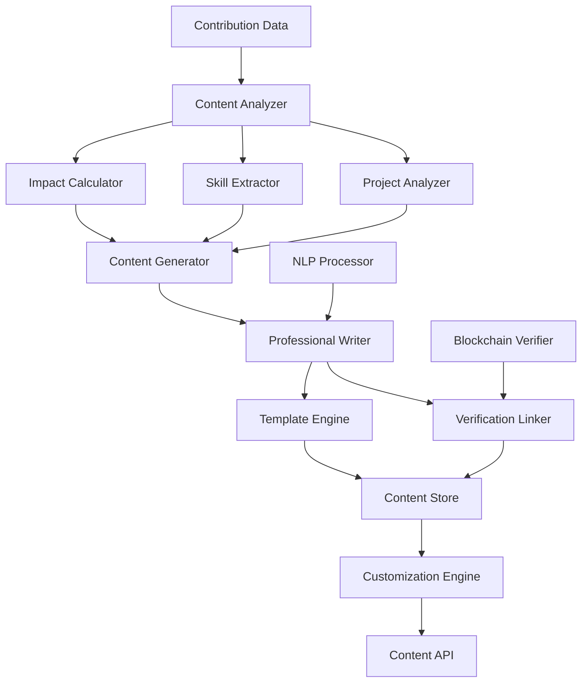

# Design Document - Contribution-Driven Content

## Overview

The Contribution-Driven Content system transforms validated pull request history into professional career materials through intelligent analysis and content generation. The system combines natural language processing, contribution analysis, and professional writing templates to create verifiable, impactful resume entries and skill profiles that accurately represent demonstrated technical abilities.

## Architecture



The system follows a content generation pipeline architecture with the following components:

- **Content Analyzer**: Processes contribution data to extract meaningful professional content
- **Content Generator**: Creates professional descriptions and skill profiles
- **Professional Writer**: Applies industry-standard language and formatting
- **Verification System**: Links content to verifiable contribution evidence
- **Customization Engine**: Enables targeting and personalization of content

## Components and Interfaces

### Content Analyzer

**Purpose**: Analyze contribution data to extract professional content elements

**Key Classes**:
- `ContributionContentAnalyzer`: Analyzes pull requests for professional content extraction
- `ProjectImpactCalculator`: Calculates impact metrics and achievement indicators
- `TechnicalSkillExtractor`: Extracts technical skills and proficiency levels
- `ProfessionalAchievementDetector`: Identifies significant professional achievements

**Interfaces**:
```typescript
interface ContentAnalyzer {
  analyzeContributions(contributions: PullRequestRecord[]): Promise<ProfessionalContent>
  extractProjectDetails(contribution: PullRequestRecord): Promise<ProjectDetails>
}

interface ProfessionalContent {
  userId: string
  resumeEntries: ResumeEntry[]
  skillProfile: SkillProfile
  achievements: Achievement[]
  projectExperience: ProjectExperience[]
  verificationLinks: VerificationLink[]
  generatedAt: Date
  contentVersion: string
}

interface ResumeEntry {
  id: string
  projectName: string
  organizationName: string
  role: string
  duration: {
    startDate: Date
    endDate: Date
  }
  description: string
  achievements: string[]
  technologiesUsed: string[]
  impactMetrics: {
    linesOfCode: number
    filesModified: number
    featuresImplemented: number
    bugsFixed: number
  }
  verificationLinks: string[]
}
```

### Impact Calculator

**Purpose**: Calculate quantifiable impact metrics from contributions

**Key Classes**:
- `ContributionImpactAnalyzer`: Analyzes contribution scope and significance
- `ProjectScaleCalculator`: Calculates project scale and complexity metrics
- `AchievementQuantifier`: Quantifies achievements with measurable metrics
- `BusinessValueEstimator`: Estimates business value and user impact

**Interfaces**:
```typescript
interface ImpactCalculator {
  calculateContributionImpact(contribution: PullRequestRecord): Promise<ImpactMetrics>
  aggregateProjectImpact(contributions: PullRequestRecord[]): Promise<ProjectImpact>
}

interface ImpactMetrics {
  contributionId: string
  codeImpact: {
    linesAdded: number
    linesDeleted: number
    filesModified: number
    complexity: number
  }
  functionalImpact: {
    featuresAdded: number
    bugsFixed: number
    performanceImprovements: number
    securityEnhancements: number
  }
  projectImpact: {
    userBase: number
    projectPopularity: number
    communityEngagement: number
    maintenanceImprovement: number
  }
  professionalImpact: {
    collaborationScore: number
    codeQualityScore: number
    documentationScore: number
    mentorshipScore: number
  }
}

interface ProjectImpact {
  projectName: string
  totalContributions: number
  overallImpact: number
  impactCategories: {
    technical: number
    functional: number
    community: number
    business: number
  }
  significantAchievements: string[]
  quantifiableResults: string[]
}
```

### Skill Extractor

**Purpose**: Extract and quantify technical skills from contribution history

**Key Classes**:
- `TechnicalSkillAnalyzer`: Analyzes code changes to identify technical skills
- `SkillProficiencyCalculator`: Calculates skill proficiency levels based on usage
- `SkillProgressionTracker`: Tracks skill development over time
- `SkillCategoryOrganizer`: Organizes skills into professional categories

**Interfaces**:
```typescript
interface SkillExtractor {
  extractSkills(contributions: PullRequestRecord[]): Promise<ExtractedSkills>
  calculateProficiency(skill: string, usage: SkillUsage[]): Promise<ProficiencyLevel>
}

interface ExtractedSkills {
  programmingLanguages: {
    language: string
    proficiencyLevel: ProficiencyLevel
    experienceMonths: number
    projectCount: number
    linesOfCode: number
    evidenceLinks: string[]
  }[]
  frameworks: {
    framework: string
    proficiencyLevel: ProficiencyLevel
    projectCount: number
    complexityLevel: number
    evidenceLinks: string[]
  }[]
  tools: {
    tool: string
    proficiencyLevel: ProficiencyLevel
    usageFrequency: number
    evidenceLinks: string[]
  }[]
  domains: {
    domain: string
    experienceLevel: number
    projectCount: number
    specializations: string[]
    evidenceLinks: string[]
  }[]
  softSkills: {
    skill: string
    evidenceType: string
    examples: string[]
    evidenceLinks: string[]
  }[]
}

interface ProficiencyLevel {
  level: 'Beginner' | 'Intermediate' | 'Advanced' | 'Expert'
  score: number // 1-100
  confidence: number // 1-100
  justification: string
  evidenceCount: number
}
```

### Professional Writer

**Purpose**: Generate professional content using industry-standard language and formatting

**Key Classes**:
- `ResumeContentGenerator`: Generates professional resume entries and descriptions
- `SkillProfileWriter`: Creates comprehensive skill profile descriptions
- `AchievementDescriptor`: Writes compelling achievement descriptions
- `ProfessionalLanguageProcessor`: Applies professional writing standards

**Interfaces**:
```typescript
interface ProfessionalWriter {
  generateResumeEntry(projectData: ProjectData, template: ResumeTemplate): Promise<ResumeEntry>
  writeSkillDescription(skill: ExtractedSkill, context: SkillContext): Promise<SkillDescription>
}

interface ResumeTemplate {
  format: 'chronological' | 'functional' | 'combination'
  style: 'traditional' | 'modern' | 'technical'
  emphasis: 'achievements' | 'skills' | 'projects'
  length: 'concise' | 'detailed'
  industry: string
}

interface SkillDescription {
  skillName: string
  proficiencyStatement: string
  experienceDescription: string
  projectExamples: string[]
  achievementHighlights: string[]
  verificationLinks: string[]
  professionalContext: string
}

interface ProfessionalLanguage {
  actionVerbs: string[]
  industryTerms: string[]
  achievementFrameworks: string[]
  quantificationPatterns: string[]
  professionalTone: string
}
```

### Verification Linker

**Purpose**: Link professional content to verifiable contribution evidence

**Key Classes**:
- `ContributionVerifier`: Creates verifiable links to contribution evidence
- `BlockchainLogger`: Logs contributions to immutable verification system
- `EvidenceAggregator`: Aggregates evidence for professional claims
- `VerificationTokenGenerator`: Generates cryptographic verification tokens

**Interfaces**:
```typescript
interface VerificationLinker {
  createVerificationLinks(content: ProfessionalContent): Promise<VerificationPackage>
  generateVerificationToken(contribution: PullRequestRecord): Promise<VerificationToken>
}

interface VerificationPackage {
  contentId: string
  verificationHash: string
  evidenceLinks: {
    claimId: string
    claimText: string
    evidenceType: 'pull_request' | 'commit' | 'issue' | 'review'
    evidenceUrl: string
    verificationToken: string
    timestamp: Date
  }[]
  blockchainRecord: {
    transactionHash: string
    blockNumber: number
    networkId: string
  }
  verificationInstructions: string
  expirationDate: Date
}

interface VerificationToken {
  tokenId: string
  contributionHash: string
  userHash: string
  repositoryHash: string
  timestamp: Date
  cryptographicSignature: string
  verificationUrl: string
}
```

### Customization Engine

**Purpose**: Enable targeting and personalization of professional content

**Key Classes**:
- `ContentCustomizer`: Customizes content based on user preferences and targets
- `JobTargetingEngine`: Tailors content for specific job requirements
- `ContentVersionManager`: Manages multiple versions of professional content
- `PersonalizationEngine`: Applies personal branding and style preferences

**Interfaces**:
```typescript
interface CustomizationEngine {
  customizeContent(content: ProfessionalContent, preferences: CustomizationPreferences): Promise<CustomizedContent>
  targetForJob(content: ProfessionalContent, jobRequirements: JobRequirements): Promise<TargetedContent>
}

interface CustomizationPreferences {
  userId: string
  targetIndustry: string
  careerLevel: 'entry' | 'mid' | 'senior'
  emphasizedSkills: string[]
  preferredProjects: string[]
  contentStyle: ContentStyle
  brandingPreferences: BrandingPreferences
}

interface JobRequirements {
  jobTitle: string
  requiredSkills: string[]
  preferredSkills: string[]
  industryContext: string
  experienceLevel: string
  companySize: string
  techStack: string[]
}

interface CustomizedContent {
  baseContentId: string
  customizationId: string
  targetedResumeEntries: ResumeEntry[]
  prioritizedSkills: ExtractedSkills
  emphasizedAchievements: Achievement[]
  tailoredDescriptions: string[]
  customizationMetadata: {
    targetJob: string
    customizationDate: Date
    emphasisAreas: string[]
  }
}
```

## Data Models

### Professional Content Schema
```typescript
interface ProfessionalContentRecord {
  id: string
  userId: string
  contentType: 'resume_entry' | 'skill_profile' | 'achievement' | 'project_summary'
  title: string
  description: string
  content: {
    formattedText: string
    structuredData: any
    metadata: {
      generationDate: Date
      sourceContributions: string[]
      verificationLinks: string[]
      impactMetrics: any
    }
  }
  verification: {
    verificationHash: string
    evidenceLinks: string[]
    blockchainRecord?: string
    verificationStatus: 'verified' | 'pending' | 'unverified'
  }
  customizations: {
    customizationId: string
    targetContext: string
    modifications: string[]
    createdAt: Date
  }[]
  createdAt: Date
  updatedAt: Date
  version: number
}
```

### Skill Profile Schema
```typescript
interface SkillProfileRecord {
  id: string
  userId: string
  skillCategory: 'programming_language' | 'framework' | 'tool' | 'domain' | 'soft_skill'
  skillName: string
  proficiencyLevel: string
  proficiencyScore: number
  experienceMetrics: {
    monthsOfExperience: number
    projectCount: number
    contributionCount: number
    complexityLevel: number
  }
  evidence: {
    contributionIds: string[]
    projectNames: string[]
    verificationLinks: string[]
    achievementExamples: string[]
  }
  professionalDescription: string
  lastUpdated: Date
  verificationStatus: string
}
```

## Error Handling

### Content Generation Errors
- **Insufficient Data**: Handle cases with limited contribution history gracefully
- **Analysis Failures**: Provide fallback content generation when analysis fails
- **Template Processing Errors**: Use alternative templates when primary ones fail
- **Language Processing Issues**: Handle NLP failures with manual content options

### Verification Errors
- **Blockchain Integration Failures**: Provide alternative verification methods
- **Link Validation Issues**: Handle broken or inaccessible contribution links
- **Cryptographic Errors**: Implement fallback verification mechanisms
- **External API Failures**: Cache verification data for offline validation

### Customization Errors
- **Preference Conflicts**: Resolve conflicting customization preferences intelligently
- **Template Compatibility Issues**: Ensure content works across different formats
- **Version Management Errors**: Handle version conflicts and data consistency
- **Export Format Issues**: Provide alternative export options when primary formats fail