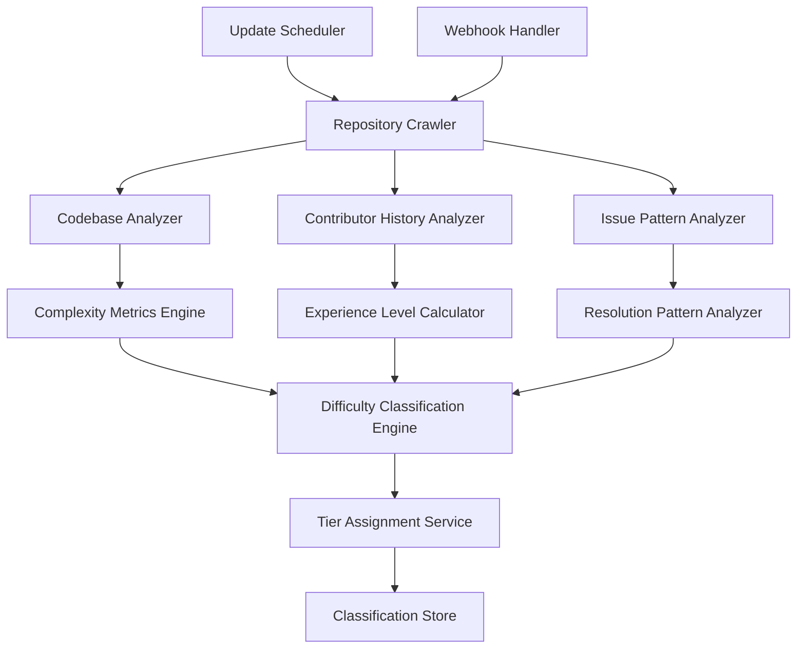

# Design Document - Difficulty Tier System

## Overview

The Difficulty Tier System uses machine learning and statistical analysis to automatically classify open source issues into three difficulty tiers: Beginner, Intermediate, and Advanced. The system analyzes multiple data sources including repository metrics, contributor history, code complexity, and issue resolution patterns to generate accurate difficulty assessments that evolve with repository changes.

## Architecture



The system follows a data pipeline architecture with the following components:

- **Data Collection Layer**: Crawls repositories and extracts relevant metrics
- **Analysis Layer**: Processes raw data into meaningful complexity indicators
- **Classification Layer**: Applies machine learning models to determine difficulty tiers
- **Storage Layer**: Maintains classification results and historical data
- **Update Layer**: Handles real-time updates and periodic re-evaluation

## Components and Interfaces

### Codebase Analyzer

**Purpose**: Analyze repository structure and code complexity metrics

**Key Classes**:
- `CodebaseMetricsCalculator`: Computes size and complexity metrics
- `DependencyGraphAnalyzer`: Analyzes code dependencies and coupling
- `ArchitecturalPatternDetector`: Identifies architectural complexity patterns
- `DocumentationAnalyzer`: Evaluates documentation quality and completeness

**Interfaces**:
```typescript
interface CodebaseAnalyzer {
  analyzeRepository(repoUrl: string): Promise<CodebaseMetrics>
  calculateComplexityScore(filePaths: string[]): Promise<number>
}

interface CodebaseMetrics {
  repositoryUrl: string
  totalLinesOfCode: number
  fileCount: number
  directoryDepth: number
  cyclomaticComplexity: number
  dependencyCount: number
  architecturalComplexity: number
  documentationScore: number
  testCoverage: number
}
```

### Contributor History Analyzer

**Purpose**: Analyze contributor experience levels and contribution patterns

**Key Classes**:
- `ContributorExperienceCalculator`: Determines experience levels of contributors
- `ContributionPatternAnalyzer`: Analyzes where different experience levels contribute
- `MaintainerActivityTracker`: Tracks maintainer engagement and responsiveness
- `CommunityHealthAnalyzer`: Evaluates overall community activity and health

**Interfaces**:
```typescript
interface ContributorHistoryAnalyzer {
  analyzeContributors(repoUrl: string): Promise<ContributorAnalysis>
  calculateExperienceLevel(contributorId: string): Promise<ExperienceLevel>
}

interface ContributorAnalysis {
  repositoryUrl: string
  totalContributors: number
  experienceLevels: {
    beginner: number
    intermediate: number
    advanced: number
  }
  contributionAreas: ContributionArea[]
  maintainerActivity: number
  communityHealthScore: number
}

interface ContributionArea {
  filePath: string
  contributorExperienceLevels: ExperienceLevel[]
  averageExperienceLevel: number
  contributionFrequency: number
}
```

### Issue Pattern Analyzer

**Purpose**: Analyze historical issue resolution patterns and complexity indicators

**Key Classes**:
- `ResolutionTimeAnalyzer`: Analyzes time-to-resolution patterns
- `IssueComplexityExtractor`: Extracts complexity indicators from issue content
- `CommentPatternAnalyzer`: Analyzes discussion patterns and iteration cycles
- `LabelPatternAnalyzer`: Learns from existing difficulty labels and patterns

**Interfaces**:
```typescript
interface IssuePatternAnalyzer {
  analyzeIssueHistory(repoUrl: string): Promise<IssuePatterns>
  predictComplexity(issueContent: string, repoMetrics: CodebaseMetrics): Promise<number>
}

interface IssuePatterns {
  repositoryUrl: string
  averageResolutionTime: {
    beginner: number
    intermediate: number
    advanced: number
  }
  commentPatterns: {
    averageComments: number
    iterationCycles: number
  }
  labelDistribution: {
    [label: string]: DifficultyTier
  }
}
```

### Difficulty Classification Engine

**Purpose**: Apply machine learning models to determine difficulty tiers

**Key Classes**:
- `DifficultyClassifier`: Main classification algorithm
- `FeatureExtractor`: Extracts features for machine learning model
- `ModelTrainer`: Trains and updates classification models
- `ConfidenceCalculator`: Calculates confidence scores for classifications

**Interfaces**:
```typescript
interface DifficultyClassifier {
  classifyIssue(issueId: string, features: ClassificationFeatures): Promise<DifficultyClassification>
  updateModel(trainingData: TrainingExample[]): Promise<void>
}

interface ClassificationFeatures {
  codebaseMetrics: CodebaseMetrics
  contributorAnalysis: ContributorAnalysis
  issuePatterns: IssuePatterns
  issueSpecificFactors: {
    affectedFiles: string[]
    componentComplexity: number
    requiredSkills: string[]
  }
}

interface DifficultyClassification {
  issueId: string
  difficultyTier: DifficultyTier
  confidenceScore: number
  contributingFactors: {
    codebaseComplexity: number
    contributorExperience: number
    historicalPatterns: number
  }
  reasoning: string[]
}
```

## Data Models

### Difficulty Classification Schema
```typescript
interface DifficultyClassification {
  id: string
  issueId: string
  repositoryUrl: string
  difficultyTier: 'beginner' | 'intermediate' | 'advanced'
  confidenceScore: number
  classificationFactors: {
    codebaseComplexity: number
    contributorExperience: number
    historicalPatterns: number
    issueSpecificFactors: number
  }
  reasoning: string[]
  classifiedAt: Date
  lastUpdated: Date
  version: number
}
```

### Repository Metrics Schema
```typescript
interface RepositoryMetrics {
  id: string
  repositoryUrl: string
  codebaseMetrics: {
    linesOfCode: number
    fileCount: number
    directoryDepth: number
    cyclomaticComplexity: number
    dependencyCount: number
    testCoverage: number
  }
  contributorMetrics: {
    totalContributors: number
    activeContributors: number
    experienceDistribution: {
      beginner: number
      intermediate: number
      advanced: number
    }
    maintainerActivity: number
  }
  issueMetrics: {
    totalIssues: number
    averageResolutionTime: number
    complexityDistribution: {
      beginner: number
      intermediate: number
      advanced: number
    }
  }
  lastAnalyzed: Date
  analysisVersion: number
}
```

## Error Handling

### Data Collection Errors
- **Repository Access Issues**: Handle private repositories and API rate limits gracefully
- **Incomplete Data**: Provide fallback classification methods when data is missing
- **Large Repository Processing**: Implement sampling strategies for very large codebases
- **API Failures**: Cache previous results and use stale data when necessary

### Classification Errors
- **Model Uncertainty**: Provide confidence scores and flag uncertain classifications
- **Edge Cases**: Handle repositories with unusual characteristics or patterns
- **Conflicting Signals**: Implement weighted decision-making when factors disagree
- **New Repository Types**: Detect and adapt to unfamiliar repository patterns

### Performance Errors
- **Processing Timeouts**: Implement progressive analysis with time limits
- **Memory Constraints**: Use streaming processing for large datasets
- **Concurrent Analysis**: Manage resource usage during bulk classification updates
- **Storage Limitations**: Implement data retention policies and archival strategies