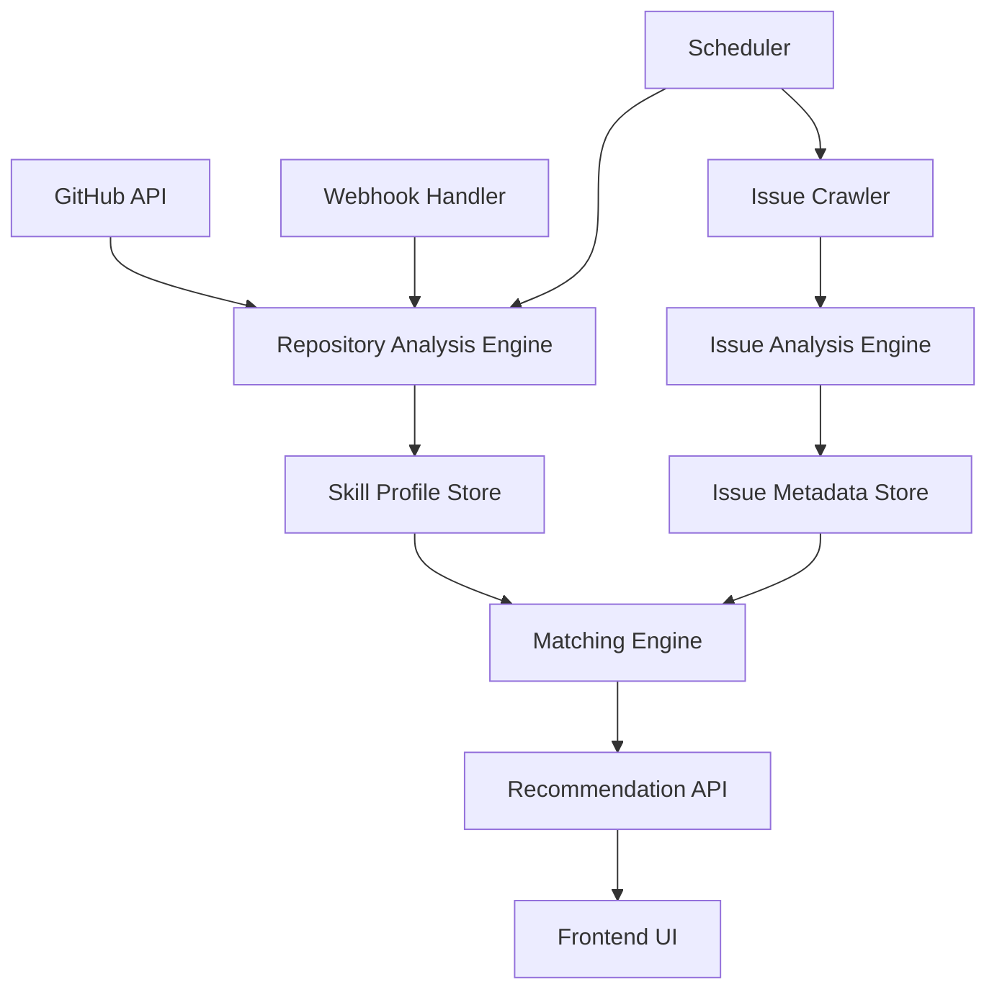

# Design Document - Dynamic Skill Filtering

## Overview

The Dynamic Skill Filtering system consists of three main components: a Repository Analysis Engine that infers user skills from GitHub repositories, an Issue Analysis Engine that extracts technical requirements from open source issues, and a Matching Engine that ranks issues based on skill relevance. The system operates through automated analysis pipelines and provides real-time recommendations through a GraphQL API.

## Architecture



The system follows a microservices architecture with the following key components:

- **Repository Analysis Service**: Processes GitHub repositories to extract skills
- **Issue Analysis Service**: Crawls and analyzes open source issues
- **Matching Service**: Implements the ranking algorithm
- **API Gateway**: Provides GraphQL interface for frontend
- **Data Layer**: Stores user profiles, issue metadata, and matching results

## Components and Interfaces

### Repository Analysis Engine

**Purpose**: Automatically infer user skills from GitHub repositories

**Key Classes**:
- `RepositoryAnalyzer`: Main orchestrator for repository analysis
- `LanguageDetector`: Identifies programming languages from file analysis
- `FrameworkDetector`: Extracts frameworks from package files and imports
- `DomainClassifier`: Infers domain expertise from repository metadata
- `SkillProfileBuilder`: Aggregates analysis results into skill profiles

**Interfaces**:
```typescript
interface RepositoryAnalyzer {
  analyzeUserRepositories(userId: string, githubToken: string): Promise<SkillProfile>
  analyzeRepository(repoUrl: string): Promise<RepositorySkills>
}

interface SkillProfile {
  userId: string
  programmingLanguages: LanguageSkill[]
  frameworks: FrameworkSkill[]
  domains: DomainSkill[]
  lastUpdated: Date
  proficiencyScore: number
}

interface LanguageSkill {
  language: string
  proficiencyLevel: number // 1-10 scale
  linesOfCode: number
  recentActivity: boolean
}
```

### Issue Analysis Engine

**Purpose**: Extract technical requirements and metadata from open source issues

**Key Classes**:
- `IssueAnalyzer`: Processes issue content and metadata
- `TechnicalRequirementExtractor`: Identifies required skills from issue text
- `LabelProcessor`: Analyzes GitHub labels for difficulty and category hints
- `RepositoryMetadataExtractor`: Gathers context about the parent repository

**Interfaces**:
```typescript
interface IssueAnalyzer {
  analyzeIssue(issueUrl: string): Promise<IssueProfile>
  extractRequirements(issueContent: string): Promise<TechnicalRequirement[]>
}

interface IssueProfile {
  issueId: string
  repositoryUrl: string
  requiredLanguages: string[]
  requiredFrameworks: string[]
  domainArea: string
  difficultyLevel: DifficultyLevel
  labels: string[]
  estimatedEffort: number
}
```

### Matching Engine

**Purpose**: Rank issues based on user skill relevance

**Key Classes**:
- `SkillMatcher`: Core matching algorithm implementation
- `RelevanceCalculator`: Computes skill overlap scores
- `RankingEngine`: Sorts and prioritizes issue recommendations
- `FilterEngine`: Applies user preferences and constraints

**Interfaces**:
```typescript
interface SkillMatcher {
  findMatchingIssues(userProfile: SkillProfile, availableIssues: IssueProfile[]): Promise<RankedIssue[]>
  calculateRelevanceScore(userSkills: SkillProfile, issueRequirements: IssueProfile): number
}

interface RankedIssue {
  issue: IssueProfile
  relevanceScore: number
  matchingSkills: string[]
  missingSkills: string[]
  confidenceLevel: number
}
```

## Data Models

### User Skill Profile Schema
```typescript
interface UserSkillProfile {
  id: string
  userId: string
  githubUsername: string
  programmingLanguages: {
    language: string
    proficiencyLevel: number
    linesOfCode: number
    repositoryCount: number
    lastUsed: Date
  }[]
  frameworks: {
    framework: string
    proficiencyLevel: number
    projectCount: number
    lastUsed: Date
  }[]
  domains: {
    domain: string
    experienceLevel: number
    repositoryCount: number
  }[]
  overallExperienceLevel: number
  createdAt: Date
  updatedAt: Date
}
```

### Issue Metadata Schema
```typescript
interface IssueMetadata {
  id: string
  githubIssueId: number
  repositoryUrl: string
  title: string
  description: string
  labels: string[]
  requiredSkills: {
    languages: string[]
    frameworks: string[]
    domains: string[]
  }
  difficultyLevel: 'beginner' | 'intermediate' | 'advanced'
  estimatedHours: number
  maintainerActivity: number
  communityEngagement: number
  createdAt: Date
  updatedAt: Date
}
```

## Error Handling

### Repository Analysis Errors
- **GitHub API Rate Limiting**: Implement exponential backoff and queue management
- **Private Repository Access**: Handle OAuth token expiration and permission errors
- **Repository Analysis Failures**: Log errors and continue with partial analysis
- **Skill Detection Accuracy**: Provide confidence scores and manual override options

### Issue Analysis Errors
- **Issue Content Parsing**: Handle malformed or incomplete issue descriptions
- **Repository Metadata Unavailable**: Use fallback analysis methods
- **Skill Requirement Ambiguity**: Apply conservative matching when uncertain

### Matching Engine Errors
- **No Matching Issues**: Provide alternative suggestions and learning resources
- **Performance Degradation**: Implement caching and result pagination
- **Stale Data**: Detect and refresh outdated skill profiles and issue data

