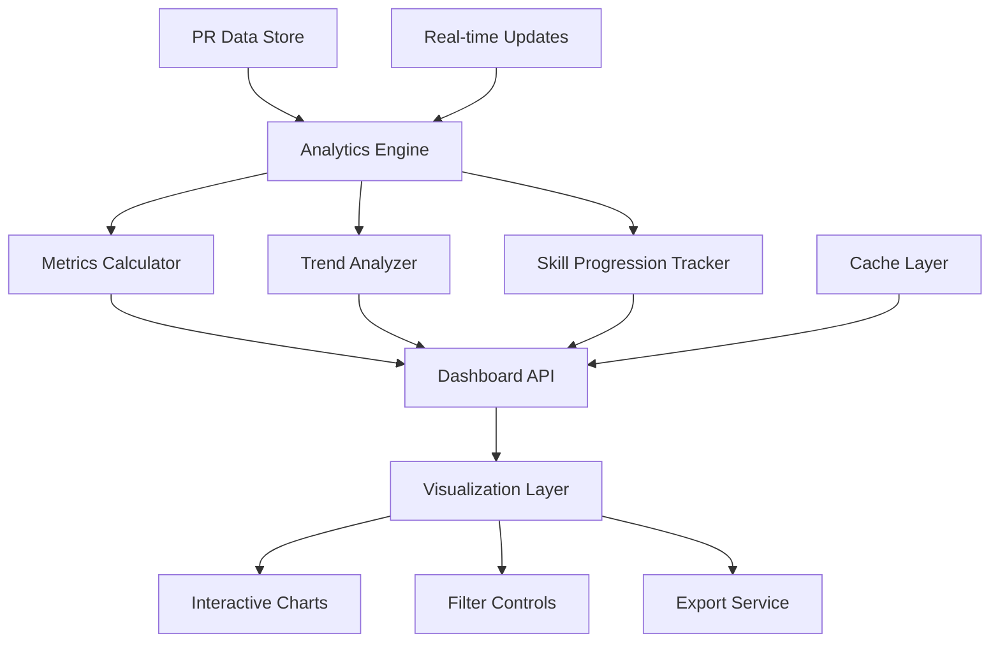

# Design Document - Impact Analytics Dashboard

## Overview

The Impact Analytics Dashboard is a comprehensive visualization system that transforms student contribution data into interactive charts and metrics. The system analyzes pull request data to generate insights about contribution breadth, skill depth, and growth trajectories, providing students with actionable feedback about their open source development journey.

## Architecture



The system follows a data-driven architecture with the following components:

- **Analytics Engine**: Processes PR data to generate meaningful metrics and insights
- **Visualization Layer**: Renders interactive charts and dashboards using modern charting libraries
- **API Layer**: Provides data endpoints for dashboard components with filtering and aggregation
- **Export Layer**: Handles data export and sharing functionality
- **Caching Layer**: Optimizes performance for frequently accessed analytics data

## Components and Interfaces

### Analytics Engine

**Purpose**: Process contribution data to generate comprehensive analytics and insights

**Key Classes**:
- `ContributionAnalyzer`: Analyzes overall contribution patterns and trends
- `SkillBreadthCalculator`: Measures diversity of skills and technologies used
- `ComplexityProgressionTracker`: Tracks increasing complexity over time
- `ImpactMetricsCalculator`: Calculates contribution impact and quality metrics

**Interfaces**:
```typescript
interface AnalyticsEngine {
  generateUserAnalytics(userId: string, timeRange?: DateRange): Promise<UserAnalytics>
  calculateSkillBreadth(contributions: PullRequestRecord[]): Promise<SkillBreadthMetrics>
}

interface UserAnalytics {
  userId: string
  timeRange: DateRange
  contributionMetrics: ContributionMetrics
  skillBreadth: SkillBreadthMetrics
  complexityProgression: ComplexityProgression
  impactMetrics: ImpactMetrics
  generatedAt: Date
}

interface ContributionMetrics {
  totalPullRequests: number
  mergedPullRequests: number
  rejectedPullRequests: number
  averageReviewTime: number
  contributionFrequency: {
    daily: number[]
    weekly: number[]
    monthly: number[]
  }
  repositoriesContributedTo: number
  organizationsContributedTo: number
}
```

### Skill Breadth Calculator

**Purpose**: Analyze the diversity and distribution of skills across contributions

**Key Classes**:
- `TechnologyDiversityAnalyzer`: Measures variety of technologies used
- `ProjectCategoryAnalyzer`: Analyzes distribution across project types
- `DomainCoverageCalculator`: Calculates coverage across different domains
- `SkillDistributionCalculator`: Computes skill usage percentages and patterns

**Interfaces**:
```typescript
interface SkillBreadthCalculator {
  calculateBreadthMetrics(contributions: PullRequestRecord[]): Promise<SkillBreadthMetrics>
  analyzeTechnologyDiversity(skillTags: SkillTag[]): Promise<TechnologyDiversity>
}

interface SkillBreadthMetrics {
  programmingLanguages: {
    language: string
    contributionCount: number
    percentage: number
    firstUsed: Date
    lastUsed: Date
  }[]
  frameworks: {
    framework: string
    contributionCount: number
    percentage: number
  }[]
  projectCategories: {
    category: string
    contributionCount: number
    percentage: number
    repositories: string[]
  }[]
  domains: {
    domain: string
    contributionCount: number
    skillDepth: number
  }[]
  diversityScore: number
}

interface TechnologyDiversity {
  totalTechnologies: number
  primaryTechnologies: string[]
  emergingTechnologies: string[]
  diversityIndex: number
}
```

### Complexity Progression Tracker

**Purpose**: Track skill development and increasing contribution complexity over time

**Key Classes**:
- `SkillProgressionAnalyzer`: Analyzes skill development trajectories
- `ComplexityTrendCalculator`: Calculates complexity trends over time
- `MilestoneDetector`: Identifies significant achievements and breakthroughs
- `LearningCurveAnalyzer`: Analyzes learning patterns and time-to-competency

**Interfaces**:
```typescript
interface ComplexityProgressionTracker {
  trackProgression(contributions: PullRequestRecord[]): Promise<ComplexityProgression>
  detectMilestones(progressionData: ProgressionData[]): Promise<Milestone[]>
}

interface ComplexityProgression {
  overallComplexityTrend: {
    date: Date
    complexityScore: number
    contributionCount: number
  }[]
  skillSpecificProgression: {
    skill: string
    progression: {
      date: Date
      proficiencyLevel: number
      contributionComplexity: number
    }[]
  }[]
  milestones: Milestone[]
  learningCurves: {
    skill: string
    timeToCompetency: number
    progressionRate: number
  }[]
}

interface Milestone {
  date: Date
  type: 'first_contribution' | 'complexity_breakthrough' | 'new_technology' | 'major_project'
  description: string
  significance: number
  relatedContributions: string[]
}
```

### Visualization Layer

**Purpose**: Render interactive charts and dashboard components

**Key Classes**:
- `ChartRenderer`: Renders various chart types using D3.js or Chart.js
- `InteractiveFilterManager`: Manages filter state and chart updates
- `DashboardLayoutManager`: Handles responsive dashboard layout
- `AnimationController`: Manages chart animations and transitions

**Interfaces**:
```typescript
interface VisualizationLayer {
  renderChart(chartConfig: ChartConfig, data: any[]): Promise<ChartInstance>
  updateChart(chartId: string, newData: any[]): Promise<void>
}

interface ChartConfig {
  type: 'line' | 'bar' | 'pie' | 'scatter' | 'heatmap' | 'treemap'
  title: string
  xAxis: AxisConfig
  yAxis: AxisConfig
  filters: FilterConfig[]
  interactivity: InteractivityConfig
  exportOptions: ExportConfig
}

interface FilterConfig {
  type: 'date' | 'technology' | 'project' | 'complexity'
  options: FilterOption[]
  multiSelect: boolean
  defaultValue?: any
}

interface ChartInstance {
  id: string
  element: HTMLElement
  update: (data: any[]) => void
  export: (format: 'png' | 'svg' | 'pdf') => Promise<Blob>
  destroy: () => void
}
```

### Export Service

**Purpose**: Handle data export and sharing functionality

**Key Classes**:
- `ChartExporter`: Exports charts in various formats
- `ReportGenerator`: Generates comprehensive PDF reports
- `ShareLinkGenerator`: Creates shareable links for analytics views
- `EmbedWidgetGenerator`: Generates embeddable widgets for external sites

**Interfaces**:
```typescript
interface ExportService {
  exportChart(chartId: string, format: ExportFormat): Promise<ExportResult>
  generateReport(userId: string, reportConfig: ReportConfig): Promise<ReportResult>
}

interface ExportFormat {
  type: 'png' | 'svg' | 'pdf' | 'csv' | 'json'
  quality?: number
  dimensions?: { width: number; height: number }
}

interface ReportConfig {
  includeCharts: string[]
  timeRange: DateRange
  sections: ReportSection[]
  branding?: BrandingConfig
}

interface ReportResult {
  reportId: string
  downloadUrl: string
  shareableLink: string
  generatedAt: Date
  expiresAt: Date
}
```

## Data Models

### Analytics Data Schema
```typescript
interface AnalyticsData {
  id: string
  userId: string
  timeRange: {
    startDate: Date
    endDate: Date
  }
  metrics: {
    totalContributions: number
    mergedContributions: number
    averageComplexity: number
    skillBreadthScore: number
    impactScore: number
  }
  skillBreakdown: {
    language: string
    contributionCount: number
    complexityProgression: number[]
    firstUsed: Date
    lastUsed: Date
  }[]
  projectBreakdown: {
    category: string
    contributionCount: number
    averageImpact: number
    repositories: string[]
  }[]
  timeSeriesData: {
    date: Date
    contributionCount: number
    complexityScore: number
    newSkillsLearned: number
  }[]
  calculatedAt: Date
  version: number
}
```

### Dashboard Configuration Schema
```typescript
interface DashboardConfig {
  id: string
  userId: string
  layout: {
    chartId: string
    position: { x: number; y: number }
    size: { width: number; height: number }
    chartType: string
    dataSource: string
  }[]
  filters: {
    filterId: string
    type: string
    value: any
    isActive: boolean
  }[]
  preferences: {
    theme: 'light' | 'dark'
    animationsEnabled: boolean
    autoRefresh: boolean
    refreshInterval: number
  }
  createdAt: Date
  updatedAt: Date
}
```

## Error Handling

### Data Processing Errors
- **Insufficient Data**: Handle cases where users have limited contribution history
- **Data Inconsistencies**: Resolve conflicts in contribution data from multiple sources
- **Calculation Errors**: Provide fallback metrics when complex calculations fail
- **Missing Metadata**: Generate analytics with available data when metadata is incomplete

### Visualization Errors
- **Chart Rendering Failures**: Provide fallback visualizations when complex charts fail to render
- **Performance Issues**: Implement data sampling for large datasets that cause rendering problems
- **Browser Compatibility**: Ensure charts work across different browsers and devices
- **Memory Constraints**: Optimize chart rendering for devices with limited memory

### Export Errors
- **Export Failures**: Provide alternative export formats when primary format fails
- **File Size Limitations**: Compress or optimize exports that exceed size limits
- **Network Issues**: Handle export failures due to network connectivity problems
- **Permission Errors**: Manage access control for shared analytics and reports