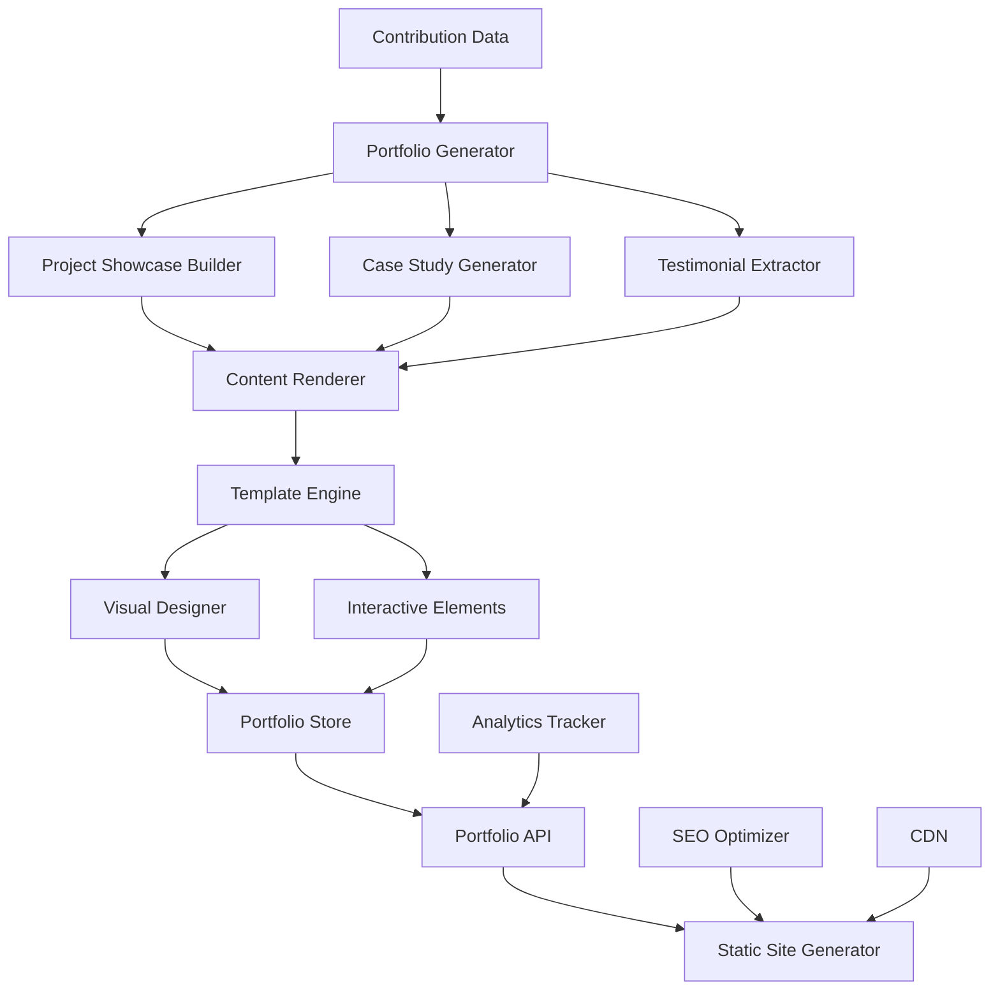

# Design Document - Interactive Portfolio Builder

## Overview

The Interactive Portfolio Builder creates dynamic, professional online portfolios that transform technical contributions into compelling visual narratives. The system combines automated content generation, responsive design templates, and interactive elements to showcase verified projects, detailed case studies, and maintainer testimonials in an engaging, employer-friendly format.

## Architecture



The system follows a content-to-presentation pipeline architecture with the following components:

- **Portfolio Generator**: Processes contribution data into portfolio-ready content
- **Content Renderer**: Transforms data into visual and interactive elements
- **Template Engine**: Applies professional design templates and layouts
- **Static Site Generator**: Creates optimized, fast-loading portfolio websites
- **Analytics and SEO**: Provides discoverability and engagement tracking

## Components and Interfaces

### Project Showcase Builder

**Purpose**: Transform contributions into compelling project showcases with visual elements

**Key Classes**:
- `ProjectShowcaseGenerator`: Creates comprehensive project presentations
- `VisualContentCreator`: Generates screenshots, diagrams, and visual elements
- `ProjectNarrativeBuilder`: Builds engaging project stories and descriptions
- `TechnologyStackVisualizer`: Creates visual representations of technology usage

**Interfaces**:
```typescript
interface ProjectShowcaseBuilder {
  buildShowcase(projectData: ProjectData): Promise<ProjectShowcase>
  generateVisualElements(project: ProjectData): Promise<VisualElement[]>
}

interface ProjectShowcase {
  projectId: string
  title: string
  description: string
  overview: {
    summary: string
    duration: string
    role: string
    teamSize: number
    projectType: string
  }
  technicalDetails: {
    technologies: TechnologyItem[]
    architecture: string
    challenges: string[]
    solutions: string[]
  }
  visualElements: {
    screenshots: Screenshot[]
    diagrams: Diagram[]
    codeSnippets: CodeSnippet[]
    demos: Demo[]
  }
  metrics: {
    linesOfCode: number
    commits: number
    filesChanged: number
    impact: string
  }
  verificationLinks: VerificationLink[]
  createdAt: Date
}

interface VisualElement {
  type: 'screenshot' | 'diagram' | 'code' | 'demo' | 'chart'
  title: string
  description: string
  content: string | Buffer
  metadata: {
    format: string
    size: number
    dimensions?: { width: number; height: number }
  }
}
```

### Case Study Generator

**Purpose**: Create detailed case studies that demonstrate problem-solving and technical decision-making

**Key Classes**:
- `CaseStudyBuilder`: Constructs comprehensive case studies from contributions
- `ProblemSolutionAnalyzer`: Analyzes problems solved and solutions implemented
- `TechnicalDecisionTracker`: Tracks and explains technical decisions made
- `ImpactStoryGenerator`: Creates compelling impact narratives

**Interfaces**:
```typescript
interface CaseStudyGenerator {
  generateCaseStudy(contribution: ContributionData): Promise<CaseStudy>
  analyzeProblemSolution(prData: PullRequestData): Promise<ProblemSolution>
}

interface CaseStudy {
  caseStudyId: string
  title: string
  projectContext: {
    projectName: string
    projectDescription: string
    userBase: number
    technologyStack: string[]
  }
  problemStatement: {
    description: string
    challenges: string[]
    constraints: string[]
    stakeholders: string[]
  }
  solutionApproach: {
    methodology: string
    designDecisions: DesignDecision[]
    implementationSteps: ImplementationStep[]
    alternativesConsidered: string[]
  }
  technicalImplementation: {
    codeChanges: CodeChange[]
    architecturalChanges: string[]
    testingStrategy: string
    performanceConsiderations: string[]
  }
  results: {
    quantifiableOutcomes: Metric[]
    qualitativeImpact: string[]
    lessonsLearned: string[]
    futureImprovements: string[]
  }
  verification: {
    pullRequestUrl: string
    commitHashes: string[]
    reviewComments: string[]
    maintainerFeedback: string[]
  }
}

interface DesignDecision {
  decision: string
  rationale: string
  alternatives: string[]
  tradeoffs: string[]
  outcome: string
}
```

### Testimonial Extractor

**Purpose**: Extract and curate maintainer testimonials and positive feedback

**Key Classes**:
- `FeedbackExtractor`: Extracts positive feedback from pull request comments
- `TestimonialCurator`: Curates and formats testimonials for portfolio display
- `MaintainerProfiler`: Profiles maintainers to add credibility to testimonials
- `SentimentAnalyzer`: Analyzes sentiment and identifies positive feedback

**Interfaces**:
```typescript
interface TestimonialExtractor {
  extractTestimonials(contributions: ContributionData[]): Promise<Testimonial[]>
  analyzeFeedback(comments: Comment[]): Promise<FeedbackAnalysis>
}

interface Testimonial {
  testimonialId: string
  content: string
  author: {
    name: string
    role: string
    organization: string
    profileUrl: string
    credibility: number
  }
  context: {
    projectName: string
    contributionType: string
    dateReceived: Date
    pullRequestUrl: string
  }
  sentiment: {
    score: number
    confidence: number
    keywords: string[]
  }
  skills: {
    skillsEndorsed: string[]
    specificPraise: string[]
  }
  verification: {
    sourceUrl: string
    verified: boolean
    verificationDate: Date
  }
}

interface FeedbackAnalysis {
  overallSentiment: number
  positiveComments: Comment[]
  skillEndorsements: SkillEndorsement[]
  professionalQualities: string[]
  improvementSuggestions: string[]
}
```

### Template Engine

**Purpose**: Apply professional design templates and create responsive layouts

**Key Classes**:
- `PortfolioTemplateManager`: Manages portfolio design templates
- `ResponsiveLayoutGenerator`: Creates responsive layouts for different devices
- `ThemeCustomizer`: Applies themes and branding customizations
- `ComponentLibrary`: Provides reusable UI components for portfolios

**Interfaces**:
```typescript
interface TemplateEngine {
  applyTemplate(content: PortfolioContent, template: PortfolioTemplate): Promise<RenderedPortfolio>
  customizeTheme(portfolio: RenderedPortfolio, theme: ThemeConfiguration): Promise<ThemedPortfolio>
}

interface PortfolioTemplate {
  templateId: string
  name: string
  description: string
  style: 'modern' | 'classic' | 'minimal' | 'creative' | 'technical'
  layout: {
    sections: TemplateSection[]
    navigation: NavigationConfig
    responsive: ResponsiveConfig
  }
  styling: {
    colorScheme: ColorScheme
    typography: TypographyConfig
    spacing: SpacingConfig
    animations: AnimationConfig
  }
  components: {
    header: ComponentConfig
    projectGrid: ComponentConfig
    caseStudyLayout: ComponentConfig
    testimonialDisplay: ComponentConfig
    footer: ComponentConfig
  }
}

interface RenderedPortfolio {
  portfolioId: string
  userId: string
  html: string
  css: string
  javascript: string
  assets: Asset[]
  metadata: {
    title: string
    description: string
    keywords: string[]
    ogTags: OpenGraphTag[]
  }
  performance: {
    loadTime: number
    sizeKB: number
    lighthouse: LighthouseScore
  }
}
```

### Static Site Generator

**Purpose**: Generate optimized, fast-loading portfolio websites with SEO

**Key Classes**:
- `StaticSiteBuilder`: Builds static portfolio websites
- `SEOOptimizer`: Optimizes portfolios for search engine discoverability
- `PerformanceOptimizer`: Optimizes loading speed and performance
- `CDNDeployer`: Deploys portfolios to content delivery networks

**Interfaces**:
```typescript
interface StaticSiteGenerator {
  generateSite(portfolio: RenderedPortfolio): Promise<StaticSite>
  optimizeForSEO(site: StaticSite, seoConfig: SEOConfiguration): Promise<OptimizedSite>
}

interface StaticSite {
  siteId: string
  userId: string
  domain: string
  pages: {
    path: string
    html: string
    metadata: PageMetadata
  }[]
  assets: {
    path: string
    content: Buffer
    contentType: string
    optimized: boolean
  }[]
  sitemap: string
  robotsTxt: string
  manifest: WebManifest
  deploymentConfig: DeploymentConfig
}

interface SEOConfiguration {
  title: string
  description: string
  keywords: string[]
  canonicalUrl: string
  socialMedia: {
    twitter: string
    linkedin: string
    github: string
  }
  structuredData: StructuredData
  analytics: AnalyticsConfig
}
```

### Analytics Tracker

**Purpose**: Track portfolio engagement and provide insights to users

**Key Classes**:
- `PortfolioAnalytics`: Tracks portfolio views and user interactions
- `EngagementMetrics`: Measures visitor engagement and behavior
- `ConversionTracker`: Tracks conversion events like contact form submissions
- `InsightGenerator`: Generates actionable insights from analytics data

**Interfaces**:
```typescript
interface AnalyticsTracker {
  trackPortfolioView(portfolioId: string, visitor: VisitorData): Promise<void>
  generateInsights(portfolioId: string, timeRange: TimeRange): Promise<PortfolioInsights>
}

interface PortfolioInsights {
  portfolioId: string
  timeRange: TimeRange
  traffic: {
    totalViews: number
    uniqueVisitors: number
    averageSessionDuration: number
    bounceRate: number
  }
  engagement: {
    mostViewedProjects: ProjectView[]
    popularCaseStudies: CaseStudyView[]
    testimonialInteractions: number
    downloadCount: number
  }
  demographics: {
    geographicDistribution: GeographicData[]
    deviceTypes: DeviceData[]
    referralSources: ReferralData[]
  }
  conversions: {
    contactFormSubmissions: number
    resumeDownloads: number
    socialMediaClicks: number
    externalLinkClicks: number
  }
  recommendations: {
    contentOptimization: string[]
    seoImprovements: string[]
    performanceEnhancements: string[]
  }
}
```

## Data Models

### Portfolio Configuration Schema
```typescript
interface PortfolioConfiguration {
  id: string
  userId: string
  portfolioName: string
  domain: string
  template: {
    templateId: string
    customizations: any
    theme: string
  }
  content: {
    personalInfo: {
      name: string
      title: string
      bio: string
      location: string
      contactInfo: ContactInfo
    }
    sections: {
      sectionId: string
      sectionType: string
      enabled: boolean
      order: number
      configuration: any
    }[]
    projects: string[]
    caseStudies: string[]
    testimonials: string[]
  }
  settings: {
    visibility: 'public' | 'private' | 'unlisted'
    seoEnabled: boolean
    analyticsEnabled: boolean
    customDomain?: string
  }
  createdAt: Date
  updatedAt: Date
  publishedAt?: Date
}
```

### Portfolio Analytics Schema
```typescript
interface PortfolioAnalyticsRecord {
  id: string
  portfolioId: string
  timestamp: Date
  eventType: 'view' | 'interaction' | 'conversion' | 'download'
  visitor: {
    sessionId: string
    ipHash: string
    userAgent: string
    referrer?: string
    location?: {
      country: string
      city: string
    }
  }
  interaction: {
    elementType?: string
    elementId?: string
    action?: string
    duration?: number
  }
  metadata: {
    pageUrl: string
    deviceType: string
    browserType: string
    screenResolution: string
  }
}
```

## Error Handling

### Content Generation Errors
- **Insufficient Data**: Handle cases with limited contribution history gracefully
- **Visual Generation Failures**: Provide fallback content when visual elements fail to generate
- **Template Processing Errors**: Use alternative templates when primary ones fail
- **Asset Processing Issues**: Handle image and media processing failures

### Deployment Errors
- **CDN Deployment Failures**: Provide alternative hosting options
- **Domain Configuration Issues**: Handle custom domain setup problems
- **SSL Certificate Errors**: Manage certificate provisioning and renewal
- **Performance Optimization Failures**: Ensure basic functionality when optimizations fail

### Analytics Errors
- **Tracking Script Failures**: Ensure portfolio functionality without analytics
- **Data Collection Issues**: Handle privacy settings and consent management
- **Insight Generation Failures**: Provide basic metrics when advanced analytics fail
- **Export Errors**: Handle data export and reporting failures gracefully