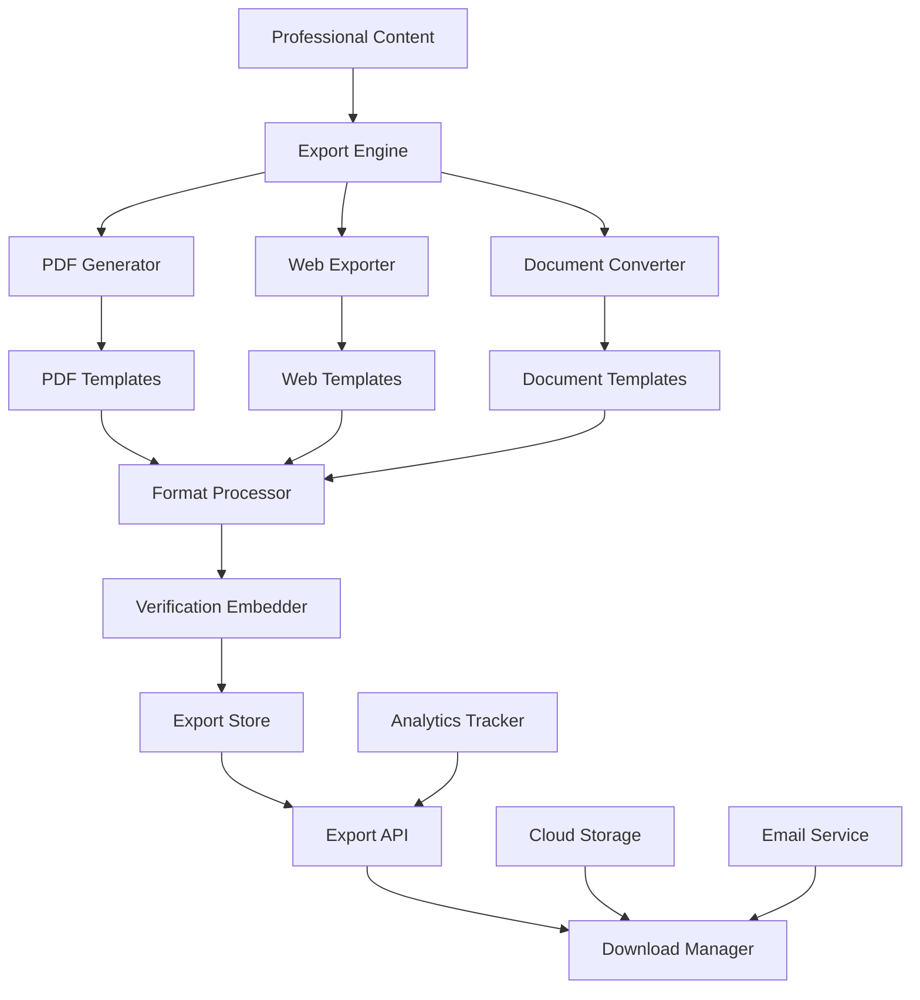

# Design Document - Multi-Format Export Options

## Overview

The Multi-Format Export Options system provides comprehensive export capabilities that transform professional content into various formats including PDF resumes, dynamic web portfolios, and editable DOCX/Markdown files. The system combines template engines, format converters, and verification systems to create portable, authentic career materials suitable for different professional contexts.

## Architecture



The system follows a multi-format generation pipeline with the following components:

- **Export Engine**: Orchestrates content transformation across different formats
- **Format Generators**: Specialized generators for PDF, web, and document formats
- **Template Systems**: Provides professional templates for each export format
- **Verification System**: Embeds authenticity markers and verification links
- **Distribution Layer**: Manages export delivery and sharing capabilities

## Components and Interfaces

### PDF Generator

**Purpose**: Generate professional PDF resumes with various layout templates and verification

**Key Classes**:
- `PDFResumeGenerator`: Creates professional PDF resume documents
- `PDFTemplateEngine`: Manages PDF layout templates and styling
- `PDFVerificationEmbedder`: Embeds verification QR codes and links in PDFs
- `PDFOptimizer`: Optimizes PDFs for size, quality, and print compatibility

**Interfaces**:
```typescript
interface PDFGenerator {
  generateResume(content: ProfessionalContent, template: PDFTemplate): Promise<PDFDocument>
  embedVerification(pdf: PDFDocument, verification: VerificationData): Promise<PDFDocument>
}

interface PDFDocument {
  documentId: string
  userId: string
  content: Buffer
  metadata: {
    title: string
    author: string
    subject: string
    keywords: string[]
    creator: string
    producer: string
  }
  properties: {
    pageCount: number
    sizeKB: number
    dimensions: { width: number; height: number }
    colorSpace: string
  }
  verification: {
    qrCodes: QRCode[]
    verificationUrls: string[]
    digitalSignature?: string
  }
  template: {
    templateId: string
    customizations: any
  }
  generatedAt: Date
}

interface PDFTemplate {
  templateId: string
  name: string
  description: string
  industry: string[]
  style: 'traditional' | 'modern' | 'creative' | 'technical' | 'executive'
  layout: {
    pageSize: 'A4' | 'Letter' | 'Legal'
    margins: { top: number; right: number; bottom: number; left: number }
    columns: number
    sections: PDFSection[]
  }
  styling: {
    fonts: FontConfiguration[]
    colors: ColorScheme
    spacing: SpacingConfiguration
    borders: BorderConfiguration
  }
  features: {
    includePhoto: boolean
    includeQRCode: boolean
    includeVerificationSection: boolean
    supportMultiPage: boolean
  }
}
```

### Web Exporter

**Purpose**: Generate dynamic, interactive web portfolio pages with responsive design

**Key Classes**:
- `WebPortfolioGenerator`: Creates standalone web portfolio pages
- `InteractiveElementBuilder`: Builds interactive components and animations
- `ResponsiveWebOptimizer`: Optimizes web exports for performance and compatibility
- `WebVerificationIntegrator`: Integrates verification and analytics into web exports

**Interfaces**:
```typescript
interface WebExporter {
  generatePortfolio(content: PortfolioContent, template: WebTemplate): Promise<WebPortfolio>
  optimizeForWeb(portfolio: WebPortfolio, options: OptimizationOptions): Promise<OptimizedWebPortfolio>
}

interface WebPortfolio {
  portfolioId: string
  userId: string
  files: {
    html: string
    css: string
    javascript: string
    assets: Asset[]
  }
  metadata: {
    title: string
    description: string
    keywords: string[]
    author: string
    viewport: string
  }
  features: {
    responsive: boolean
    interactive: boolean
    animated: boolean
    seoOptimized: boolean
  }
  verification: {
    embeddedLinks: string[]
    analyticsCode: string
    verificationBadges: VerificationBadge[]
  }
  performance: {
    loadTime: number
    sizeKB: number
    lighthouseScore: LighthouseMetrics
  }
  generatedAt: Date
}

interface WebTemplate {
  templateId: string
  name: string
  description: string
  style: 'modern' | 'classic' | 'minimal' | 'creative' | 'portfolio'
  framework: 'vanilla' | 'react' | 'vue' | 'static'
  features: {
    animations: AnimationConfig[]
    interactions: InteractionConfig[]
    responsiveBreakpoints: BreakpointConfig[]
    seoFeatures: SEOFeatureConfig[]
  }
  assets: {
    stylesheets: string[]
    scripts: string[]
    fonts: string[]
    images: string[]
  }
}
```

### Document Converter

**Purpose**: Convert content to editable formats like DOCX and Markdown

**Key Classes**:
- `DOCXGenerator`: Creates Microsoft Word-compatible documents
- `MarkdownConverter`: Converts content to structured Markdown format
- `DocumentFormatter`: Applies formatting and structure to editable documents
- `MetadataEmbedder`: Embeds verification metadata in document formats

**Interfaces**:
```typescript
interface DocumentConverter {
  generateDOCX(content: ProfessionalContent, template: DOCXTemplate): Promise<DOCXDocument>
  generateMarkdown(content: ProfessionalContent, options: MarkdownOptions): Promise<MarkdownDocument>
}

interface DOCXDocument {
  documentId: string
  userId: string
  content: Buffer
  metadata: {
    title: string
    author: string
    subject: string
    keywords: string[]
    comments: string
    lastModifiedBy: string
  }
  structure: {
    sections: DocumentSection[]
    styles: StyleDefinition[]
    headers: HeaderFooter[]
    footers: HeaderFooter[]
  }
  verification: {
    embeddedLinks: string[]
    metadata: VerificationMetadata
    comments: VerificationComment[]
  }
  compatibility: {
    wordVersion: string
    features: string[]
    macros: boolean
  }
  generatedAt: Date
}

interface MarkdownDocument {
  documentId: string
  userId: string
  content: string
  metadata: {
    title: string
    author: string
    description: string
    tags: string[]
    frontMatter: FrontMatter
  }
  structure: {
    headings: MarkdownHeading[]
    sections: MarkdownSection[]
    links: MarkdownLink[]
    codeBlocks: MarkdownCodeBlock[]
  }
  verification: {
    verificationLinks: string[]
    sourceAttribution: string[]
    metadataComments: string[]
  }
  formatting: {
    syntax: 'github' | 'commonmark' | 'extended'
    extensions: string[]
    tableOfContents: boolean
  }
  generatedAt: Date
}
```

### Verification Embedder

**Purpose**: Embed verification markers and authenticity data across all export formats

**Key Classes**:
- `VerificationQRGenerator`: Generates QR codes for verification links
- `DigitalSignatureManager`: Creates and manages digital signatures for documents
- `VerificationLinkManager`: Manages verification URLs and tracking
- `AuthenticityMarkerEmbedder`: Embeds various authenticity markers in exports

**Interfaces**:
```typescript
interface VerificationEmbedder {
  embedVerification(document: ExportDocument, verification: VerificationPackage): Promise<VerifiedDocument>
  generateQRCode(verificationUrl: string, options: QRCodeOptions): Promise<QRCode>
}

interface VerificationPackage {
  verificationId: string
  userId: string
  contentHash: string
  verificationUrl: string
  digitalSignature: string
  timestamp: Date
  expirationDate: Date
  verificationMethods: {
    qrCode: QRCodeData
    directLink: string
    apiEndpoint: string
    blockchainRecord?: string
  }
  embeddingOptions: {
    includeQRCode: boolean
    includeDirectLinks: boolean
    includeMetadata: boolean
    includeWatermark: boolean
  }
}

interface QRCode {
  qrCodeId: string
  data: string
  image: Buffer
  format: 'PNG' | 'SVG' | 'PDF'
  size: number
  errorCorrection: 'L' | 'M' | 'Q' | 'H'
  styling: {
    foregroundColor: string
    backgroundColor: string
    logo?: Buffer
  }
}
```

### Export Manager

**Purpose**: Orchestrate export processes and manage batch operations

**Key Classes**:
- `ExportOrchestrator`: Coordinates multi-format export operations
- `BatchExportProcessor`: Handles batch export requests and queuing
- `ExportTemplateManager`: Manages export templates and presets
- `ExportDeliveryManager`: Handles export delivery and sharing

**Interfaces**:
```typescript
interface ExportManager {
  createExport(request: ExportRequest): Promise<ExportResult>
  batchExport(requests: ExportRequest[]): Promise<BatchExportResult>
}

interface ExportRequest {
  requestId: string
  userId: string
  contentId: string
  exportFormats: ExportFormat[]
  customizations: {
    templates: { [format: string]: string }
    branding: BrandingOptions
    content: ContentSelections
    verification: VerificationOptions
  }
  delivery: {
    method: 'download' | 'email' | 'cloud' | 'api'
    recipients?: string[]
    cloudStorage?: CloudStorageConfig
    notifications: boolean
  }
  metadata: {
    purpose: string
    targetAudience: string
    deadline?: Date
    priority: 'low' | 'normal' | 'high'
  }
}

interface ExportResult {
  exportId: string
  requestId: string
  status: 'completed' | 'failed' | 'partial'
  exports: {
    format: ExportFormat
    documentId: string
    downloadUrl: string
    sizeKB: number
    generatedAt: Date
  }[]
  verification: {
    verificationPackageId: string
    verificationUrls: string[]
    qrCodes: string[]
  }
  delivery: {
    method: string
    deliveredAt?: Date
    trackingInfo?: string
  }
  analytics: {
    generationTime: number
    downloadCount: number
    shareCount: number
  }
}
```

## Data Models

### Export Configuration Schema
```typescript
interface ExportConfiguration {
  id: string
  userId: string
  name: string
  description: string
  formats: {
    format: 'pdf' | 'web' | 'docx' | 'markdown'
    templateId: string
    customizations: any
    enabled: boolean
  }[]
  content: {
    sections: string[]
    projects: string[]
    skills: string[]
    achievements: string[]
  }
  branding: {
    colors: ColorScheme
    fonts: FontConfiguration
    logo?: string
    watermark?: string
  }
  verification: {
    includeQRCodes: boolean
    includeDirectLinks: boolean
    includeMetadata: boolean
    digitalSignature: boolean
  }
  delivery: {
    defaultMethod: string
    cloudStorage?: CloudStorageConfig
    emailSettings?: EmailConfig
  }
  createdAt: Date
  updatedAt: Date
}
```

### Export Analytics Schema
```typescript
interface ExportAnalyticsRecord {
  id: string
  exportId: string
  userId: string
  timestamp: Date
  eventType: 'generated' | 'downloaded' | 'shared' | 'viewed' | 'verified'
  format: string
  metadata: {
    userAgent?: string
    ipHash?: string
    referrer?: string
    location?: {
      country: string
      city: string
    }
  }
  performance: {
    generationTime?: number
    fileSize?: number
    downloadTime?: number
  }
  verification: {
    verificationAttempts?: number
    verificationSuccess?: boolean
    verificationMethod?: string
  }
}
```

## Error Handling

### Generation Errors
- **Template Processing Failures**: Provide fallback templates when primary ones fail
- **Content Formatting Issues**: Handle malformed or incomplete content gracefully
- **Asset Processing Errors**: Manage image and media processing failures
- **Memory and Performance Issues**: Implement streaming and chunking for large exports

### Verification Errors
- **QR Code Generation Failures**: Provide alternative verification methods
- **Digital Signature Issues**: Handle certificate and signing failures
- **Verification Link Problems**: Ensure verification URLs remain accessible
- **Blockchain Integration Failures**: Provide fallback verification systems

### Delivery Errors
- **Download Failures**: Provide alternative download methods and retry mechanisms
- **Email Delivery Issues**: Handle email service failures and spam filtering
- **Cloud Storage Problems**: Manage cloud service outages and authentication issues
- **File Corruption**: Implement integrity checks and regeneration capabilities