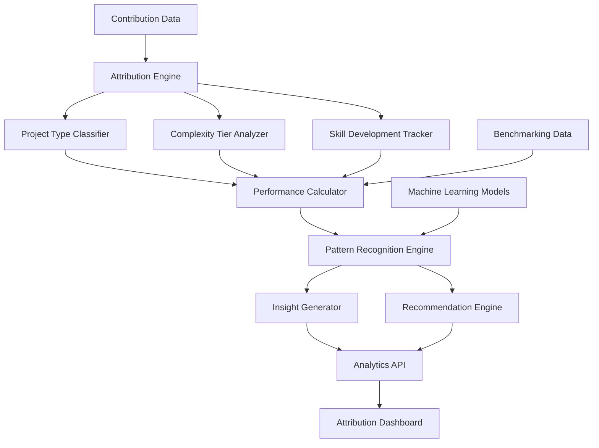

# Design Document - Performance Attribution Analysis

## Overview

The Performance Attribution Analysis system provides comprehensive analysis of student contribution patterns across project types, complexity tiers, and skill development trajectories. The system uses advanced analytics to categorize performance, identify patterns, and generate actionable insights for skill development and career guidance.

## Architecture



The system follows an analytics-driven architecture with the following components:

- **Attribution Engine**: Categorizes and analyzes contributions across multiple dimensions
- **Performance Calculator**: Computes performance metrics for different categories and complexity levels
- **Pattern Recognition Engine**: Identifies trends, correlations, and learning patterns
- **Insight Generator**: Produces actionable insights and performance summaries
- **Recommendation Engine**: Generates personalized guidance for skill development

## Components and Interfaces

### Project Type Classifier

**Purpose**: Categorize contributions by project type and analyze domain-specific performance

**Key Classes**:
- `ProjectTypeAnalyzer`: Classifies projects into categories and analyzes performance
- `DomainPerformanceCalculator`: Computes performance metrics for each project type
- `CrossDomainAnalyzer`: Analyzes performance patterns across different domains
- `DomainEvolutionTracker`: Tracks changes in domain focus over time

**Interfaces**:
```typescript
interface ProjectTypeClassifier {
  classifyContributions(contributions: PullRequestRecord[]): Promise<ProjectTypeAnalysis>
  calculateDomainPerformance(projectType: ProjectType, contributions: PullRequestRecord[]): Promise<DomainPerformance>
}

interface ProjectTypeAnalysis {
  userId: string
  projectTypes: {
    type: ProjectType
    contributionCount: number
    successRate: number
    averageReviewTime: number
    mergeRate: number
    impactScore: number
    performanceRank: number
  }[]
  dominantDomains: ProjectType[]
  emergingDomains: ProjectType[]
  underexploredDomains: ProjectType[]
  domainEvolution: {
    timeRange: DateRange
    domainShifts: DomainShift[]
  }
}

interface DomainPerformance {
  projectType: ProjectType
  metrics: {
    totalContributions: number
    successRate: number
    averageComplexity: number
    averageImpact: number
    reviewEfficiency: number
  }
  trends: {
    performanceImprovement: number
    consistencyScore: number
    learningVelocity: number
  }
  benchmarks: {
    peerComparison: number
    industryStandard: number
  }
}
```

### Complexity Tier Analyzer

**Purpose**: Analyze performance attribution across different complexity levels

**Key Classes**:
- `ComplexityPerformanceAnalyzer`: Analyzes performance at different complexity tiers
- `TierProgressionTracker`: Tracks progression between complexity levels
- `ComplexityReadinessCalculator`: Determines readiness for higher complexity tiers
- `OptimalComplexityFinder`: Identifies optimal complexity levels for current skills

**Interfaces**:
```typescript
interface ComplexityTierAnalyzer {
  analyzeComplexityPerformance(contributions: PullRequestRecord[]): Promise<ComplexityPerformanceAnalysis>
  calculateTierReadiness(currentPerformance: TierPerformance[]): Promise<TierReadiness>
}

interface ComplexityPerformanceAnalysis {
  userId: string
  tierPerformance: {
    tier: ComplexityTier
    contributionCount: number
    successRate: number
    averageReviewCycles: number
    mergeTime: number
    qualityScore: number
    confidenceLevel: number
  }[]
  progressionMetrics: {
    tierAdvancementRate: number
    complexityGrowthTrend: number
    breakthroughMoments: Breakthrough[]
  }
  optimalTiers: ComplexityTier[]
  readinessAssessment: TierReadiness[]
}

interface TierReadiness {
  targetTier: ComplexityTier
  readinessScore: number
  requiredImprovements: string[]
  estimatedTimeToReadiness: number
  recommendedPreparation: PreparationStep[]
}

interface Breakthrough {
  date: Date
  fromTier: ComplexityTier
  toTier: ComplexityTier
  triggerContribution: string
  significanceScore: number
}
```

### Skill Development Tracker

**Purpose**: Track skill development curves and contribution progression patterns

**Key Classes**:
- `SkillProgressionAnalyzer`: Analyzes skill development trajectories
- `LearningVelocityCalculator`: Measures learning speed and efficiency
- `ContributionProgressionTracker`: Tracks increasing impact and quality
- `SkillPredictionEngine`: Predicts future skill development based on current patterns

**Interfaces**:
```typescript
interface SkillDevelopmentTracker {
  trackSkillProgression(contributions: PullRequestRecord[]): Promise<SkillProgressionAnalysis>
  calculateLearningVelocity(skill: string, contributions: PullRequestRecord[]): Promise<LearningVelocity>
}

interface SkillProgressionAnalysis {
  userId: string
  skillCurves: {
    skill: string
    progressionPoints: {
      date: Date
      proficiencyLevel: number
      contributionQuality: number
      complexityHandled: number
    }[]
    learningPhases: LearningPhase[]
    projectedGrowth: GrowthProjection
  }[]
  overallProgression: {
    learningVelocity: number
    skillDiversification: number
    depthVsBreadthRatio: number
  }
  plateauPeriods: PlateauPeriod[]
  accelerationPeriods: AccelerationPeriod[]
}

interface LearningVelocity {
  skill: string
  velocityScore: number
  improvementRate: number
  consistencyIndex: number
  timeToCompetency: number
  learningEfficiency: number
}

interface LearningPhase {
  phase: 'exploration' | 'acceleration' | 'mastery' | 'plateau'
  startDate: Date
  endDate: Date
  characteristics: string[]
  keyContributions: string[]
}
```

### Pattern Recognition Engine

**Purpose**: Identify correlations, patterns, and optimization opportunities across dimensions

**Key Classes**:
- `PerformanceCorrelationAnalyzer`: Identifies correlations between different performance dimensions
- `PatternDetector`: Detects recurring patterns in contribution behavior
- `OptimizationFinder`: Identifies optimal combinations of project type and complexity
- `AnomalyDetector`: Detects unusual performance patterns or outliers

**Interfaces**:
```typescript
interface PatternRecognitionEngine {
  analyzePerformancePatterns(attributionData: AttributionData): Promise<PatternAnalysis>
  findOptimalCombinations(performanceData: PerformanceData): Promise<OptimalCombination[]>
}

interface PatternAnalysis {
  userId: string
  correlations: {
    dimensions: [string, string]
    correlationStrength: number
    significance: number
    interpretation: string
  }[]
  patterns: {
    patternType: string
    frequency: number
    contexts: string[]
    impact: number
  }[]
  anomalies: {
    type: string
    date: Date
    description: string
    potentialCauses: string[]
  }[]
  optimizationOpportunities: OptimizationOpportunity[]
}

interface OptimalCombination {
  projectType: ProjectType
  complexityTier: ComplexityTier
  expectedSuccessRate: number
  expectedImpact: number
  confidenceLevel: number
  recommendationStrength: number
}

interface OptimizationOpportunity {
  type: 'skill_focus' | 'complexity_adjustment' | 'domain_expansion' | 'efficiency_improvement'
  description: string
  potentialImpact: number
  implementationDifficulty: number
  timeframe: string
}
```

### Recommendation Engine

**Purpose**: Generate actionable insights and personalized guidance for skill development

**Key Classes**:
- `InsightGenerator`: Produces comprehensive performance insights
- `RecommendationCalculator`: Generates specific recommendations based on analysis
- `LearningPathOptimizer`: Optimizes learning paths based on performance data
- `ProgressTracker`: Monitors improvement against recommendations

**Interfaces**:
```typescript
interface RecommendationEngine {
  generateRecommendations(analysisData: ComprehensiveAnalysis): Promise<RecommendationSet>
  optimizeLearningPath(currentSkills: SkillSet, goals: LearningGoal[]): Promise<LearningPath>
}

interface RecommendationSet {
  userId: string
  primaryRecommendations: {
    type: RecommendationType
    priority: number
    description: string
    expectedBenefit: string
    actionSteps: ActionStep[]
    timeframe: string
    successMetrics: string[]
  }[]
  skillDevelopmentPriorities: {
    skill: string
    currentLevel: number
    targetLevel: number
    recommendedActions: string[]
    resources: LearningResource[]
  }[]
  projectRecommendations: {
    projectType: ProjectType
    complexityTier: ComplexityTier
    rationale: string
    expectedOutcome: string
  }[]
  generatedAt: Date
  validUntil: Date
}

interface LearningPath {
  pathId: string
  userId: string
  goals: LearningGoal[]
  milestones: {
    milestone: string
    targetDate: Date
    requiredSkills: string[]
    measurableOutcomes: string[]
  }[]
  recommendedProjects: ProjectRecommendation[]
  estimatedDuration: number
  difficultyProgression: number[]
}
```

## Data Models

### Attribution Analysis Schema
```typescript
interface AttributionAnalysis {
  id: string
  userId: string
  analysisDate: Date
  projectTypePerformance: {
    projectType: string
    contributionCount: number
    successRate: number
    averageImpact: number
    performanceScore: number
    rank: number
  }[]
  complexityTierPerformance: {
    tier: string
    contributionCount: number
    successRate: number
    averageQuality: number
    readinessScore: number
  }[]
  skillProgressionData: {
    skill: string
    currentProficiency: number
    learningVelocity: number
    projectedGrowth: number
    timeToNextLevel: number
  }[]
  performancePatterns: {
    patternType: string
    strength: number
    contexts: string[]
    recommendations: string[]
  }[]
  insights: {
    type: string
    description: string
    confidence: number
    actionable: boolean
  }[]
  recommendations: {
    priority: number
    category: string
    description: string
    expectedImpact: number
    timeframe: string
  }[]
  calculatedAt: Date
  version: number
}
```

### Performance Benchmark Schema
```typescript
interface PerformanceBenchmark {
  id: string
  benchmarkType: 'peer_group' | 'industry_standard' | 'historical_self'
  projectType?: string
  complexityTier?: string
  skill?: string
  metrics: {
    successRate: number
    averageImpact: number
    learningVelocity: number
    qualityScore: number
  }
  sampleSize: number
  confidenceInterval: number
  lastUpdated: Date
}
```

## Error Handling

### Analysis Errors
- **Insufficient Data**: Handle cases with limited contribution history gracefully
- **Classification Ambiguity**: Provide confidence scores when project classification is uncertain
- **Pattern Detection Failures**: Use fallback analysis methods when pattern recognition fails
- **Correlation Calculation Errors**: Handle edge cases in statistical analysis

### Recommendation Errors
- **Conflicting Recommendations**: Resolve conflicts between different recommendation algorithms
- **Outdated Analysis**: Detect and refresh stale analysis data automatically
- **Personalization Failures**: Provide generic recommendations when personalization fails
- **Resource Availability**: Handle cases where recommended resources are unavailable

### Performance Errors
- **Complex Analysis Timeouts**: Implement progressive analysis with time limits
- **Memory Intensive Calculations**: Use streaming processing for large datasets
- **Concurrent Analysis**: Manage resource usage during bulk analysis operations
- **Cache Invalidation**: Handle cache consistency during real-time updates