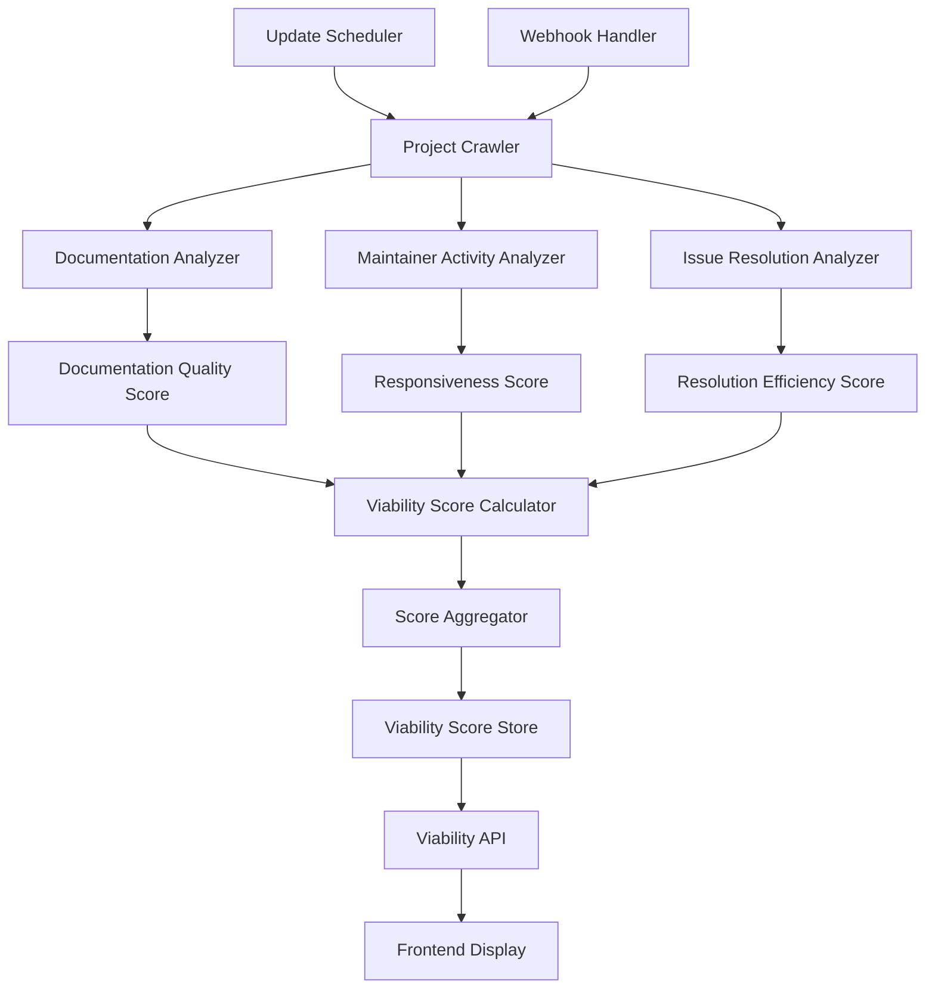

# Design Document - Project Viability Scoring

## Overview

The Project Viability Scoring system evaluates open source projects using a comprehensive 1-10 scoring algorithm that analyzes documentation quality, maintainer responsiveness, and issue resolution efficiency. The system combines multiple metrics into a weighted score that helps students identify well-maintained projects with active communities and good learning opportunities.

## Architecture



The system follows a modular scoring architecture with the following components:

- **Data Collection Layer**: Crawls project repositories and extracts relevant metrics
- **Analysis Layer**: Processes data into specific quality indicators
- **Scoring Layer**: Calculates individual component scores and aggregates them
- **Storage Layer**: Maintains viability scores and historical trends
- **API Layer**: Provides access to viability data for frontend consumption

## Components and Interfaces

### Documentation Analyzer

**Purpose**: Evaluate the quality and completeness of project documentation

**Key Classes**:
- `ReadmeAnalyzer`: Analyzes README file completeness and quality
- `ContributionGuidelineAnalyzer`: Evaluates contribution documentation
- `CodeDocumentationAnalyzer`: Assesses inline code documentation
- `DocumentationFreshnessTracker`: Monitors documentation update frequency

**Interfaces**:
```typescript
interface DocumentationAnalyzer {
  analyzeProjectDocumentation(repoUrl: string): Promise<DocumentationScore>
  evaluateReadmeQuality(readmeContent: string): Promise<ReadmeQuality>
}

interface DocumentationScore {
  repositoryUrl: string
  overallScore: number // 1-10 scale
  components: {
    readmeQuality: number
    contributionGuidelines: number
    codeDocumentation: number
    apiDocumentation: number
    installationInstructions: number
  }
  missingElements: string[]
  strengths: string[]
  lastAnalyzed: Date
}

interface ReadmeQuality {
  hasInstallationInstructions: boolean
  hasUsageExamples: boolean
  hasContributionGuidelines: boolean
  hasLicenseInformation: boolean
  hasProjectDescription: boolean
  readabilityScore: number
  completenessScore: number
}
```

### Maintainer Activity Analyzer

**Purpose**: Assess maintainer responsiveness and engagement levels

**Key Classes**:
- `ResponseTimeCalculator`: Measures response times to issues and PRs
- `MaintainerEngagementTracker`: Tracks maintainer interaction patterns
- `CommunityHealthAnalyzer`: Evaluates overall community activity
- `MaintenanceConsistencyAnalyzer`: Assesses regularity of maintenance activities

**Interfaces**:
```typescript
interface MaintainerActivityAnalyzer {
  analyzeMaintainerActivity(repoUrl: string): Promise<MaintainerScore>
  calculateResponseTimes(repoUrl: string): Promise<ResponseMetrics>
}

interface MaintainerScore {
  repositoryUrl: string
  overallScore: number // 1-10 scale
  metrics: {
    averageResponseTime: number // hours
    issueResponseRate: number // percentage
    prResponseRate: number // percentage
    maintainerCount: number
    recentActivity: number // commits in last 30 days
  }
  responsiveness: 'excellent' | 'good' | 'fair' | 'poor'
  consistency: number // 1-10 scale
  lastAnalyzed: Date
}

interface ResponseMetrics {
  averageIssueResponseTime: number
  averagePrResponseTime: number
  responseRateLastMonth: number
  maintainerEngagementScore: number
}
```

### Issue Resolution Analyzer

**Purpose**: Evaluate efficiency and effectiveness of issue management

**Key Classes**:
- `ResolutionTimeTracker`: Measures time from issue creation to resolution
- `IssueTriageAnalyzer`: Evaluates issue labeling and prioritization
- `BacklogHealthAnalyzer`: Assesses issue backlog management
- `ResolutionTrendAnalyzer`: Tracks improvement or decline in resolution efficiency

**Interfaces**:
```typescript
interface IssueResolutionAnalyzer {
  analyzeIssueResolution(repoUrl: string): Promise<ResolutionScore>
  calculateResolutionMetrics(repoUrl: string): Promise<ResolutionMetrics>
}

interface ResolutionScore {
  repositoryUrl: string
  overallScore: number // 1-10 scale
  metrics: {
    averageResolutionTime: number // days
    resolutionRate: number // percentage of issues resolved
    staleIssueCount: number
    triageEfficiency: number
    backlogHealth: number
  }
  trends: {
    resolutionTimeImprovement: number
    backlogGrowthRate: number
    triageConsistency: number
  }
  lastAnalyzed: Date
}

interface ResolutionMetrics {
  totalIssues: number
  resolvedIssues: number
  averageDaysToResolution: number
  staleIssuePercentage: number
  labelingConsistency: number
}
```

### Viability Score Calculator

**Purpose**: Aggregate component scores into final viability rating

**Key Classes**:
- `ScoreAggregator`: Combines component scores using weighted algorithm
- `WeightingEngine`: Applies appropriate weights to different scoring components
- `TrendAnalyzer`: Incorporates historical trends into current scoring
- `ConfidenceCalculator`: Determines confidence level in viability scores

**Interfaces**:
```typescript
interface ViabilityScoreCalculator {
  calculateViabilityScore(components: ScoreComponents): Promise<ViabilityScore>
  updateWeights(projectType: string, communitySize: number): Promise<ScoringWeights>
}

interface ScoreComponents {
  documentationScore: DocumentationScore
  maintainerScore: MaintainerScore
  resolutionScore: ResolutionScore
  projectMetadata: {
    age: number
    size: number
    language: string
    communitySize: number
  }
}

interface ViabilityScore {
  repositoryUrl: string
  overallScore: number // 1-10 scale
  componentBreakdown: {
    documentation: number
    maintainerResponsiveness: number
    issueResolution: number
  }
  weights: ScoringWeights
  confidence: number // 1-10 scale
  reasoning: string[]
  calculatedAt: Date
  trend: 'improving' | 'stable' | 'declining'
}

interface ScoringWeights {
  documentation: number
  maintainerResponsiveness: number
  issueResolution: number
  communityHealth: number
}
```

## Data Models

### Viability Score Schema
```typescript
interface ProjectViabilityScore {
  id: string
  repositoryUrl: string
  projectName: string
  overallScore: number
  componentScores: {
    documentation: number
    maintainerResponsiveness: number
    issueResolution: number
    communityHealth: number
  }
  scoringWeights: {
    documentation: number
    maintainerResponsiveness: number
    issueResolution: number
    communityHealth: number
  }
  confidence: number
  reasoning: string[]
  metadata: {
    projectAge: number
    contributorCount: number
    primaryLanguage: string
    lastCommitDate: Date
  }
  trends: {
    scoreChange: number
    trendDirection: 'up' | 'down' | 'stable'
    historicalScores: {
      date: Date
      score: number
    }[]
  }
  calculatedAt: Date
  lastUpdated: Date
  version: number
}
```

### Project Metrics Schema
```typescript
interface ProjectMetrics {
  id: string
  repositoryUrl: string
  documentationMetrics: {
    readmeScore: number
    contributionGuideScore: number
    codeDocumentationScore: number
    apiDocumentationScore: number
    overallDocumentationScore: number
  }
  maintainerMetrics: {
    averageResponseTime: number
    responseRate: number
    maintainerCount: number
    activityScore: number
    consistencyScore: number
  }
  issueMetrics: {
    averageResolutionTime: number
    resolutionRate: number
    staleIssueCount: number
    triageScore: number
    backlogHealthScore: number
  }
  communityMetrics: {
    contributorCount: number
    recentContributors: number
    communityEngagement: number
    diversityScore: number
  }
  lastAnalyzed: Date
  analysisVersion: number
}
```

## Error Handling

### Data Collection Errors
- **Repository Access Issues**: Handle private repositories and API authentication gracefully
- **Missing Documentation**: Provide fallback scoring when documentation is absent
- **Incomplete Issue Data**: Use available data and adjust confidence scores accordingly
- **API Rate Limiting**: Implement queuing and retry mechanisms for data collection

### Scoring Errors
- **Insufficient Data**: Provide confidence indicators when data is limited
- **Outlier Detection**: Identify and handle unusual project characteristics appropriately
- **Weight Calibration**: Adjust scoring weights based on project type and community size
- **Trend Calculation**: Handle projects with limited historical data gracefully

### Performance Errors
- **Large Project Processing**: Implement sampling strategies for very large projects
- **Concurrent Scoring**: Manage resource usage during bulk score calculations
- **Cache Management**: Handle cache invalidation and refresh cycles efficiently
- **Database Performance**: Optimize queries for large-scale viability score retrieval