# Design Document - Quality Metrics Dashboard

## Overview

The Quality Metrics Dashboard is a comprehensive visualization system that provides real-time insights into repository health through interactive displays of cyclomatic complexity, test coverage, and technical debt metrics. The system combines automated analysis with rich visualizations to help students understand code quality patterns and make informed contribution decisions.

## Architecture

```mermaid
graph TB
    A[Metrics Collector] --> B[Complexity Analyzer]
    A --> C[Coverage Analyzer]
    A --> D[Technical Debt Analyzer]
    
    B --> E[Metrics Processor]
    C --> E
    D --> E
    
    E --> F[Metrics Store]
    F --> G[Dashboard API]
    
    G --> H[Visualization Engine]
    H --> I[Interactive Charts]
    H --> J[Trend Analysis]
    H --> K[Comparison Tools]
    
    L[Real-time Updates] --> E
    M[Cache Layer] --> G
    
    I --> N[Quality Dashboard]
    J --> N
    K --> N
```



The system follows a data-driven visualization architecture with the following components:

- **Metrics Collector**: Gathers quality metrics from repositories and analysis tools
- **Analysis Engines**: Specialized analyzers for complexity, coverage, and technical debt
- **Metrics Processor**: Processes and aggregates metrics for visualization
- **Visualization Engine**: Renders interactive charts and dashboard components
- **Dashboard API**: Provides data endpoints with filtering and aggregation capabilities

## Components and Interfaces

### Complexity Analyzer

**Purpose**: Analyze and calculate cyclomatic complexity metrics at various levels

**Key Classes**:
- `ComplexityCalculator`: Calculates cyclomatic complexity for code files and functions
- `ComplexityAggregator`: Aggregates complexity metrics across repository levels
- `ComplexityTrendAnalyzer`: Analyzes complexity trends and patterns over time
- `ComplexityHotspotDetector`: Identifies high-complexity areas requiring attention

**Interfaces**:
```typescript
interface ComplexityAnalyzer {
  analyzeRepository(repoUrl: string): Promise<ComplexityMetrics>
  calculateFileComplexity(filePath: string, content: string): Promise<FileComplexity>
}

interface ComplexityMetrics {
  repositoryUrl: string
  overallComplexity: {
    averageComplexity: number
    totalComplexity: number
    complexityDistribution: ComplexityDistribution
    complexityGrade: 'A' | 'B' | 'C' | 'D' | 'F'
  }
  fileComplexity: {
    filePath: string
    complexity: number
    functionCount: number
    averageFunctionComplexity: number
    complexityRating: ComplexityRating
  }[]
  functionComplexity: {
    filePath: string
    functionName: string
    complexity: number
    lineCount: number
    complexityRating: ComplexityRating
  }[]
  complexityHotspots: ComplexityHotspot[]
  trends: {
    complexityChange: number
    trendDirection: 'improving' | 'stable' | 'deteriorating'
    historicalData: ComplexityHistoryPoint[]
  }
  analyzedAt: Date
}

interface ComplexityHotspot {
  location: string
  complexity: number
  impact: 'high' | 'medium' | 'low'
  recommendation: string
  effort: number // hours to refactor
}
```

### Coverage Analyzer

**Purpose**: Analyze test coverage metrics and identify testing gaps

**Key Classes**:
- `CoverageCalculator`: Calculates test coverage percentages and metrics
- `CoverageReportParser`: Parses coverage reports from various testing frameworks
- `CoverageGapAnalyzer`: Identifies uncovered code areas and testing gaps
- `CoverageTrendTracker`: Tracks coverage improvements and regressions over time

**Interfaces**:
```typescript
interface CoverageAnalyzer {
  analyzeTestCoverage(repoUrl: string): Promise<CoverageMetrics>
  parseCoverageReport(reportData: string, format: CoverageFormat): Promise<CoverageData>
}

interface CoverageMetrics {
  repositoryUrl: string
  overallCoverage: {
    linesCovered: number
    totalLines: number
    coveragePercentage: number
    branchCoverage: number
    functionCoverage: number
    coverageGrade: 'A' | 'B' | 'C' | 'D' | 'F'
  }
  fileCoverage: {
    filePath: string
    linesCovered: number
    totalLines: number
    coveragePercentage: number
    uncoveredLines: number[]
    coverageRating: CoverageRating
  }[]
  directoryCoverage: {
    directoryPath: string
    coveragePercentage: number
    fileCount: number
    averageCoverage: number
  }[]
  coverageGaps: CoverageGap[]
  trends: {
    coverageChange: number
    trendDirection: 'improving' | 'stable' | 'deteriorating'
    historicalData: CoverageHistoryPoint[]
  }
  testMetrics: {
    testCount: number
    testTypes: TestTypeBreakdown
    testQuality: number
  }
  analyzedAt: Date
}

interface CoverageGap {
  filePath: string
  uncoveredLines: number[]
  impact: 'critical' | 'high' | 'medium' | 'low'
  recommendation: string
  effort: number // hours to add tests
}
```

### Technical Debt Analyzer

**Purpose**: Calculate and track technical debt metrics and trends

**Key Classes**:
- `TechnicalDebtCalculator`: Calculates technical debt ratios and metrics
- `CodeSmellDetector`: Identifies code smells and maintainability issues
- `DebtTrendAnalyzer`: Analyzes technical debt trends and remediation progress
- `DebtPrioritizer`: Prioritizes technical debt items by impact and effort

**Interfaces**:
```typescript
interface TechnicalDebtAnalyzer {
  analyzeTechnicalDebt(repoUrl: string): Promise<TechnicalDebtMetrics>
  calculateDebtRatio(codeMetrics: CodeMetrics): Promise<DebtRatio>
}

interface TechnicalDebtMetrics {
  repositoryUrl: string
  overallDebt: {
    debtRatio: number // percentage
    debtIndex: number // 1-100 scale
    estimatedRemediationTime: number // hours
    debtGrade: 'A' | 'B' | 'C' | 'D' | 'F'
  }
  debtCategories: {
    codeSmells: DebtItem[]
    duplication: DebtItem[]
    complexity: DebtItem[]
    maintainability: DebtItem[]
    reliability: DebtItem[]
    security: DebtItem[]
  }
  debtHotspots: DebtHotspot[]
  trends: {
    debtChange: number
    trendDirection: 'improving' | 'stable' | 'deteriorating'
    historicalData: DebtHistoryPoint[]
    remediationEfforts: RemediationEffort[]
  }
  prioritizedDebt: {
    item: DebtItem
    priority: number
    impact: number
    effort: number
    roi: number // return on investment
  }[]
  analyzedAt: Date
}

interface DebtItem {
  id: string
  type: string
  severity: 'blocker' | 'critical' | 'major' | 'minor' | 'info'
  description: string
  location: string
  estimatedEffort: number // hours
  impact: string
  recommendation: string
}
```

### Visualization Engine

**Purpose**: Render interactive charts and dashboard components for metrics display

**Key Classes**:
- `MetricsChartRenderer`: Renders various chart types for metrics visualization
- `TrendVisualizationEngine`: Creates trend charts and time series visualizations
- `ComparisonChartGenerator`: Generates comparison charts for multiple repositories
- `InteractiveDashboardManager`: Manages interactive dashboard features and state

**Interfaces**:
```typescript
interface VisualizationEngine {
  renderMetricsChart(chartConfig: MetricsChartConfig, data: MetricsData): Promise<ChartInstance>
  createTrendVisualization(trendData: TrendData, timeRange: TimeRange): Promise<TrendChart>
}

interface MetricsChartConfig {
  chartType: 'gauge' | 'bar' | 'line' | 'heatmap' | 'treemap' | 'scatter'
  title: string
  metrics: MetricDefinition[]
  thresholds: QualityThreshold[]
  colorScheme: ColorScheme
  interactivity: InteractivityOptions
  exportOptions: ExportOptions
}

interface MetricsData {
  repositoryUrl: string
  timestamp: Date
  complexity: ComplexityMetrics
  coverage: CoverageMetrics
  technicalDebt: TechnicalDebtMetrics
  aggregatedScores: {
    qualityScore: number
    maintainabilityScore: number
    testabilityScore: number
  }
}

interface TrendChart {
  chartId: string
  timeRange: TimeRange
  dataPoints: TrendDataPoint[]
  trendLines: TrendLine[]
  annotations: ChartAnnotation[]
  interactiveFeatures: InteractiveFeature[]
}
```

### Dashboard API

**Purpose**: Provide data endpoints for dashboard components with filtering and aggregation

**Key Classes**:
- `MetricsDataProvider`: Provides metrics data with filtering and pagination
- `TrendDataAggregator`: Aggregates trend data across different time periods
- `ComparisonDataGenerator`: Generates comparison data for multiple repositories
- `RealTimeMetricsStreamer`: Streams real-time metrics updates to dashboard

**Interfaces**:
```typescript
interface DashboardAPI {
  getMetricsData(repoUrl: string, filters: MetricsFilter): Promise<MetricsResponse>
  getTrendData(repoUrl: string, timeRange: TimeRange): Promise<TrendResponse>
}

interface MetricsFilter {
  timeRange?: TimeRange
  metricTypes?: MetricType[]
  complexityThreshold?: number
  coverageThreshold?: number
  debtThreshold?: number
  filePatterns?: string[]
}

interface MetricsResponse {
  repository: RepositoryInfo
  metrics: MetricsData
  summary: MetricsSummary
  recommendations: QualityRecommendation[]
  lastUpdated: Date
  dataFreshness: DataFreshness
}

interface TrendResponse {
  repository: RepositoryInfo
  timeRange: TimeRange
  trendData: TrendDataPoint[]
  trendAnalysis: TrendAnalysis
  projections: QualityProjection[]
  milestones: QualityMilestone[]
}
```

## Data Models

### Quality Metrics Schema
```typescript
interface QualityMetrics {
  id: string
  repositoryUrl: string
  repositoryName: string
  timestamp: Date
  complexityMetrics: {
    averageComplexity: number
    totalComplexity: number
    complexityGrade: string
    hotspotCount: number
    complexityTrend: number
  }
  coverageMetrics: {
    overallCoverage: number
    lineCoverage: number
    branchCoverage: number
    functionCoverage: number
    coverageGrade: string
    coverageTrend: number
  }
  technicalDebtMetrics: {
    debtRatio: number
    debtIndex: number
    estimatedRemediationTime: number
    debtGrade: string
    debtTrend: number
  }
  aggregatedScores: {
    qualityScore: number
    maintainabilityScore: number
    testabilityScore: number
    overallGrade: string
  }
  analysisMetadata: {
    analysisVersion: string
    toolsUsed: string[]
    analysisTime: number
    confidence: number
  }
}
```

### Dashboard Configuration Schema
```typescript
interface DashboardConfiguration {
  id: string
  userId: string
  dashboardName: string
  layout: {
    widgetId: string
    position: { x: number; y: number }
    size: { width: number; height: number }
    widgetType: string
    configuration: any
  }[]
  filters: {
    filterId: string
    filterType: string
    value: any
    isActive: boolean
  }[]
  preferences: {
    theme: 'light' | 'dark'
    refreshInterval: number
    defaultTimeRange: string
    alertThresholds: {
      complexity: number
      coverage: number
      technicalDebt: number
    }
  }
  createdAt: Date
  updatedAt: Date
}
```

## Error Handling

### Data Collection Errors
- **Analysis Tool Failures**: Handle failures in complexity, coverage, and debt analysis tools
- **Repository Access Issues**: Manage authentication and permission errors gracefully
- **Incomplete Metrics**: Display partial metrics when some analysis components fail
- **Data Parsing Errors**: Handle malformed or incompatible metrics data formats

### Visualization Errors
- **Chart Rendering Failures**: Provide fallback visualizations when complex charts fail
- **Performance Issues**: Implement data sampling and progressive loading for large datasets
- **Browser Compatibility**: Ensure charts work across different browsers and devices
- **Real-time Update Failures**: Handle websocket disconnections and data streaming issues

### API Errors
- **Data Freshness Issues**: Handle stale data and provide appropriate freshness indicators
- **Query Performance**: Optimize queries and implement caching for large metric datasets
- **Concurrent Access**: Manage concurrent dashboard access and data consistency
- **Export Failures**: Handle export errors and provide alternative data access methods