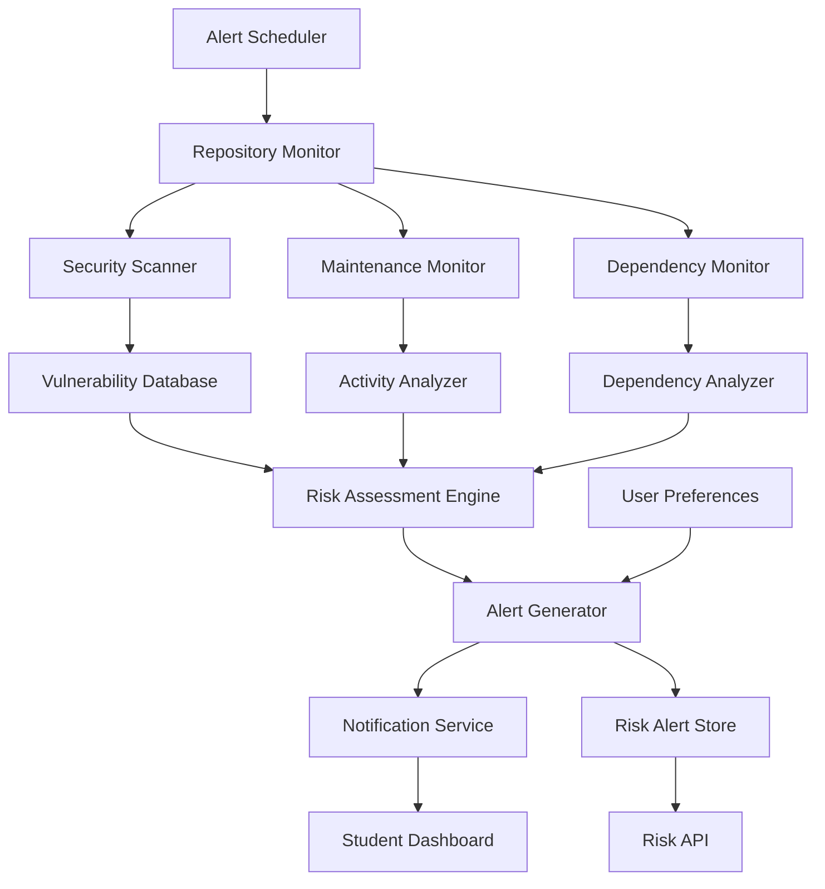

# Design Document - Risk Detection Alerts

## Overview

The Risk Detection Alerts system is a proactive monitoring and notification engine that continuously scans repositories for security vulnerabilities, maintenance issues, and dependency risks. The system provides real-time risk assessment and customizable alerting to help students make informed decisions about repository contributions while avoiding potentially problematic projects.

## Architecture



The system follows an event-driven monitoring architecture with the following components:

- **Repository Monitor**: Continuously scans repositories for changes and risk indicators
- **Risk Scanners**: Specialized scanners for security, maintenance, and dependency risks
- **Risk Assessment Engine**: Evaluates and prioritizes risks based on severity and impact
- **Alert Generator**: Creates targeted alerts based on user preferences and risk levels
- **Notification Service**: Delivers alerts through multiple channels

## Components and Interfaces

### Security Scanner

**Purpose**: Detect and assess security vulnerabilities in repositories and dependencies

**Key Classes**:
- `VulnerabilityScanner`: Scans for known security vulnerabilities
- `SecurityRiskAssessor`: Evaluates security risk levels and impact
- `CVEAnalyzer`: Analyzes Common Vulnerabilities and Exposures data
- `SecurityTrendTracker`: Tracks security improvements and regressions

**Interfaces**:
```typescript
interface SecurityScanner {
  scanRepository(repoUrl: string): Promise<SecurityRiskAssessment>
  checkVulnerabilities(dependencies: Dependency[]): Promise<VulnerabilityReport>
}

interface SecurityRiskAssessment {
  repositoryUrl: string
  overallSecurityRisk: RiskLevel
  vulnerabilities: {
    critical: SecurityVulnerability[]
    high: SecurityVulnerability[]
    medium: SecurityVulnerability[]
    low: SecurityVulnerability[]
  }
  securityScore: number // 1-100 scale
  riskFactors: {
    outdatedDependencies: number
    knownVulnerabilities: number
    securityPractices: number
    exposureLevel: number
  }
  recommendations: SecurityRecommendation[]
  lastScanned: Date
  nextScanDate: Date
}

interface SecurityVulnerability {
  id: string
  cveId?: string
  severity: 'critical' | 'high' | 'medium' | 'low'
  title: string
  description: string
  affectedComponent: string
  affectedVersions: string[]
  fixedVersion?: string
  exploitability: number
  impact: string
  remediation: string[]
  publishedDate: Date
  discoveredDate: Date
}
```

### Maintenance Monitor

**Purpose**: Monitor repository maintenance activity and detect declining maintenance patterns

**Key Classes**:
- `MaintenanceActivityTracker`: Tracks commit frequency and maintainer activity
- `ResponsivenessAnalyzer`: Analyzes maintainer response times and engagement
- `ProjectVitalityAssessor`: Assesses overall project health and sustainability
- `AbandonmentDetector`: Detects signs of project abandonment

**Interfaces**:
```typescript
interface MaintenanceMonitor {
  assessMaintenanceRisk(repoUrl: string): Promise<MaintenanceRiskAssessment>
  detectAbandonmentSigns(activityData: ActivityData): Promise<AbandonmentRisk>
}

interface MaintenanceRiskAssessment {
  repositoryUrl: string
  overallMaintenanceRisk: RiskLevel
  maintenanceMetrics: {
    lastCommitAge: number // days
    commitFrequency: number // commits per month
    maintainerResponseTime: number // hours
    issueResolutionRate: number // percentage
    communityEngagement: number // 1-100 scale
  }
  riskIndicators: {
    inactivityPeriod: number
    decliningActivity: boolean
    unresponsiveMaintainers: boolean
    stalledDevelopment: boolean
    communityDecline: boolean
  }
  maintenanceScore: number // 1-100 scale
  projectedViability: number // months
  recommendations: MaintenanceRecommendation[]
  assessedAt: Date
}

interface AbandonmentRisk {
  riskLevel: RiskLevel
  abandonmentProbability: number // 0-1 scale
  timeToAbandonmentEstimate: number // months
  warningSignsDetected: string[]
  mitigatingFactors: string[]
}
```

### Dependency Monitor

**Purpose**: Monitor dependency health and detect risks from outdated or vulnerable libraries

**Key Classes**:
- `DependencyRiskScanner`: Scans dependencies for age and security issues
- `DeprecationDetector`: Detects deprecated and abandoned dependencies
- `UpdateImpactAnalyzer`: Analyzes the impact of dependency updates
- `DependencyHealthTracker`: Tracks dependency health trends over time

**Interfaces**:
```typescript
interface DependencyMonitor {
  assessDependencyRisk(repoUrl: string): Promise<DependencyRiskAssessment>
  detectOutdatedDependencies(dependencies: Dependency[]): Promise<OutdatedDependencyReport>
}

interface DependencyRiskAssessment {
  repositoryUrl: string
  overallDependencyRisk: RiskLevel
  dependencyMetrics: {
    totalDependencies: number
    outdatedCount: number
    vulnerableCount: number
    abandonedCount: number
    averageAge: number // days behind latest
  }
  riskCategories: {
    securityRisks: DependencyRisk[]
    compatibilityRisks: DependencyRisk[]
    maintenanceRisks: DependencyRisk[]
    performanceRisks: DependencyRisk[]
  }
  dependencyScore: number // 1-100 scale
  updatePriority: UpdatePriority[]
  recommendations: DependencyRecommendation[]
  assessedAt: Date
}

interface DependencyRisk {
  dependency: string
  currentVersion: string
  latestVersion: string
  riskType: string
  severity: RiskLevel
  description: string
  impact: string
  remediation: string[]
  urgency: number // 1-10 scale
}
```

### Risk Assessment Engine

**Purpose**: Evaluate and prioritize risks across all categories for comprehensive risk scoring

**Key Classes**:
- `RiskAggregator`: Combines risks from different sources into overall assessments
- `RiskPrioritizer`: Prioritizes risks based on severity and student impact
- `RiskTrendAnalyzer`: Analyzes risk trends and predicts future risk levels
- `StudentImpactCalculator`: Calculates how risks specifically affect student contributors

**Interfaces**:
```typescript
interface RiskAssessmentEngine {
  assessOverallRisk(riskData: RiskData): Promise<OverallRiskAssessment>
  prioritizeRisks(risks: Risk[]): Promise<PrioritizedRisk[]>
}

interface OverallRiskAssessment {
  repositoryUrl: string
  overallRiskLevel: RiskLevel
  riskScore: number // 1-100 scale (lower is better)
  riskBreakdown: {
    securityRisk: number
    maintenanceRisk: number
    dependencyRisk: number
    communityRisk: number
  }
  criticalRisks: Risk[]
  highRisks: Risk[]
  studentImpactAssessment: {
    contributionDifficulty: number
    learningRisk: number
    timeWasteRisk: number
    reputationRisk: number
  }
  riskTrends: {
    improving: string[]
    stable: string[]
    deteriorating: string[]
  }
  recommendations: RiskMitigationRecommendation[]
  assessedAt: Date
  validUntil: Date
}

interface PrioritizedRisk {
  risk: Risk
  priority: number // 1-10 scale
  studentRelevance: number // 1-10 scale
  urgency: number // 1-10 scale
  actionRequired: boolean
}
```

### Alert Generator

**Purpose**: Generate customized alerts based on risk assessments and user preferences

**Key Classes**:
- `AlertRuleEngine`: Applies user-defined rules to generate relevant alerts
- `AlertPrioritizer`: Prioritizes alerts based on user preferences and risk severity
- `AlertFormatter`: Formats alerts for different delivery channels
- `AlertDeduplicator`: Prevents duplicate alerts and manages alert frequency

**Interfaces**:
```typescript
interface AlertGenerator {
  generateAlerts(riskAssessment: OverallRiskAssessment, userPreferences: AlertPreferences): Promise<Alert[]>
  processRiskChange(oldRisk: RiskAssessment, newRisk: RiskAssessment): Promise<Alert[]>
}

interface Alert {
  id: string
  userId: string
  repositoryUrl: string
  alertType: AlertType
  severity: AlertSeverity
  title: string
  message: string
  riskDetails: {
    riskType: string
    riskLevel: RiskLevel
    affectedComponents: string[]
    impact: string
    recommendations: string[]
  }
  actionItems: ActionItem[]
  createdAt: Date
  expiresAt?: Date
  acknowledged: boolean
  dismissed: boolean
}

interface AlertPreferences {
  userId: string
  enabledAlertTypes: AlertType[]
  severityThresholds: {
    security: AlertSeverity
    maintenance: AlertSeverity
    dependency: AlertSeverity
  }
  deliveryChannels: DeliveryChannel[]
  frequency: AlertFrequency
  quietHours: {
    start: string
    end: string
    timezone: string
  }
  customRules: CustomAlertRule[]
}
```

## Data Models

### Risk Alert Schema
```typescript
interface RiskAlert {
  id: string
  repositoryUrl: string
  repositoryName: string
  alertType: 'security' | 'maintenance' | 'dependency' | 'community'
  severity: 'critical' | 'high' | 'medium' | 'low'
  riskLevel: number // 1-100 scale
  title: string
  description: string
  details: {
    affectedComponents: string[]
    riskFactors: string[]
    impact: string
    timeline: string
  }
  recommendations: {
    immediate: string[]
    shortTerm: string[]
    longTerm: string[]
  }
  status: 'active' | 'acknowledged' | 'resolved' | 'dismissed'
  createdAt: Date
  updatedAt: Date
  resolvedAt?: Date
  acknowledgedBy?: string
  dismissedBy?: string
}
```

### Risk Assessment History Schema
```typescript
interface RiskAssessmentHistory {
  id: string
  repositoryUrl: string
  assessmentDate: Date
  overallRiskScore: number
  riskBreakdown: {
    securityRisk: number
    maintenanceRisk: number
    dependencyRisk: number
    communityRisk: number
  }
  detectedRisks: {
    riskId: string
    riskType: string
    severity: string
    description: string
    firstDetected: Date
    status: string
  }[]
  riskChanges: {
    riskType: string
    previousLevel: number
    currentLevel: number
    changeType: 'improvement' | 'deterioration' | 'new' | 'resolved'
  }[]
  alertsGenerated: number
  assessmentVersion: number
}
```

## Error Handling

### Scanning Errors
- **API Failures**: Handle failures in vulnerability databases and dependency registries
- **Repository Access Issues**: Manage authentication and permission errors gracefully
- **Incomplete Scans**: Provide partial risk assessments when some scans fail
- **Rate Limiting**: Implement queuing and retry mechanisms for external API calls

### Alert Errors
- **Notification Failures**: Retry failed notifications and provide alternative delivery methods
- **Preference Conflicts**: Resolve conflicts in user alert preferences intelligently
- **Alert Flooding**: Prevent alert spam through intelligent deduplication and throttling
- **Delivery Issues**: Handle network failures and service outages for alert delivery

### Assessment Errors
- **Data Inconsistencies**: Handle conflicting risk data from multiple sources
- **Scoring Failures**: Provide fallback risk scoring when primary algorithms fail
- **Trend Analysis Errors**: Handle insufficient historical data for trend analysis
- **Priority Calculation Issues**: Use conservative prioritization when calculation fails